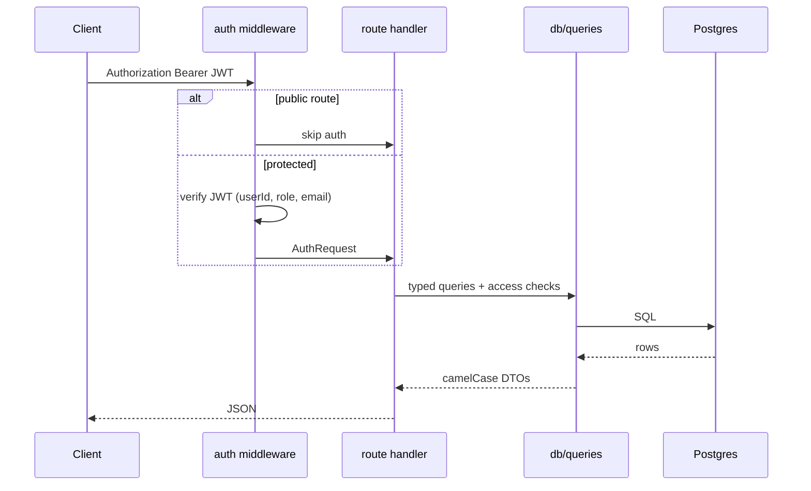
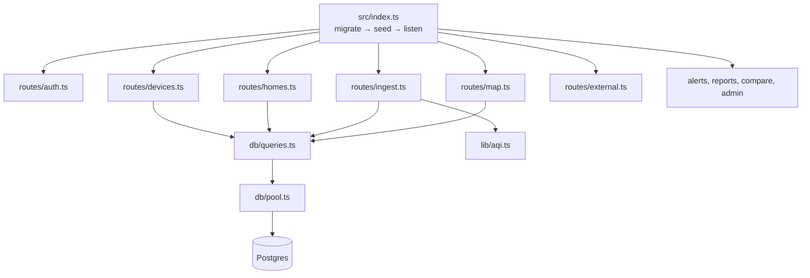
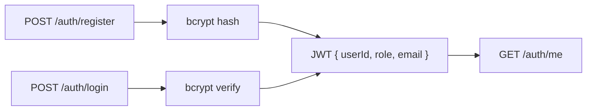

# AeroSpec API

Express + TypeScript backend. Postgres/TimescaleDB, bcrypt + JWT auth, BLE
ingestion, map aggregation, OpenAQ proxy.

**Contract**: [`docs/PIPELINE.md`](../../docs/PIPELINE.md) · **Diagrams**:
[`docs/ARCHITECTURE.md`](../../docs/ARCHITECTURE.md)

## Quick start

```bash
pnpm install          # from repo root
docker compose up -d db
pnpm db:migrate && pnpm db:seed
pnpm dev:api          # http://localhost:4000
```

Demo login: `admin@aerospec.io` / `aerospec-admin`

## Request lifecycle



## Module layout



## Authentication

Real bcrypt passwords and signed JWTs (`JWT_SECRET`).



Roles: `user` | `admin`. Home ownership is `home_members.role` (`owner` |
`member`), not a JWT role.

## Key endpoints

| Area | Routes |
|---|---|
| Auth | `POST /auth/register`, `/auth/login`, `GET /auth/me` |
| Homes | `GET/POST /homes`, `GET/POST /homes/:id/rooms` |
| Devices | `GET /devices`, `POST /devices/claim`, `GET /devices/:id/readings` |
| Ingest | `POST /ingest/readings` (max 500 rows, dedupe on `(device_id, ts)`) |
| Map | `GET /map/cells?bbox=&hours=` |
| External | `GET /external/openaq/latest?bbox=` (needs `OPENAQ_API_KEY`) |

Full table and response shapes: [`docs/PIPELINE.md`](../../docs/PIPELINE.md).

## Database

- Migrations: `src/db/migrations/*.sql` — auto-applied on boot
- Seed: `pnpm --filter @aerospec/api db:seed` or `SEED_ON_BOOT=true`
- `sensor_readings` hypertable when TimescaleDB is available

## Scripts

```bash
pnpm --filter @aerospec/api build
pnpm --filter @aerospec/api exec vitest run
pnpm --filter @aerospec/api db:migrate
pnpm --filter @aerospec/api db:seed
```

## Environment

See repo root `.env.example`: `DATABASE_URL`, `JWT_SECRET`, `OPENAQ_API_KEY`,
`PORT`, `FRONTEND_URL`.
