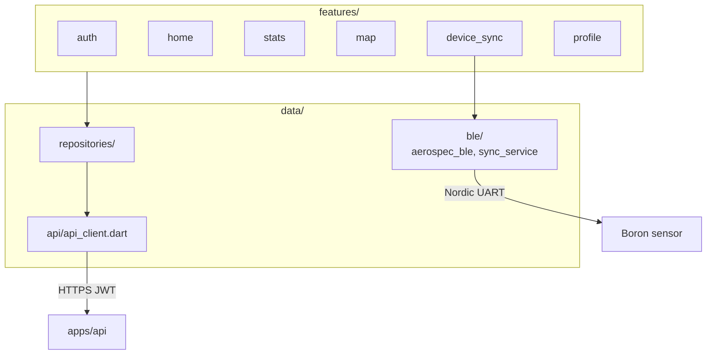
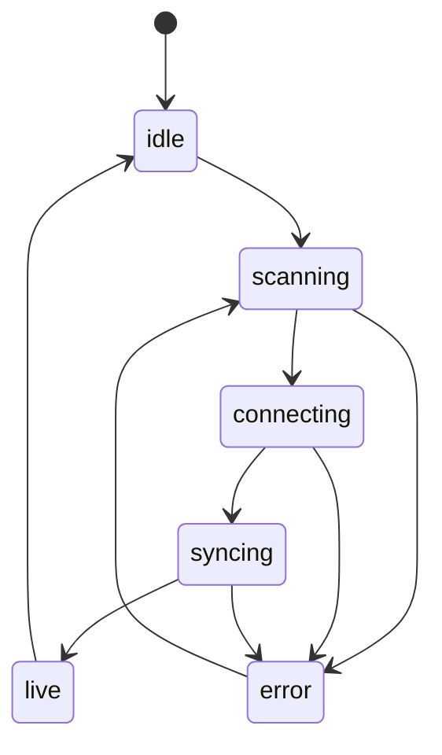

# AeroSpec Mobile App

Flutter app: BLE gateway for Boron sensors, dashboards, device pairing/sync.

**BLE contract**: [`docs/BLE_PROTOCOL.md`](docs/BLE_PROTOCOL.md) · **API**:
[`docs/API_SPECIFICATION.md`](docs/API_SPECIFICATION.md) · **Pipeline**:
[`../../docs/PIPELINE.md`](../../docs/PIPELINE.md)

## Overview



The phone is the **only cloud gateway** for hardware readings — the sensor
does not upload over Wi‑Fi/cellular in Phase 1.

## Project structure

```
apps/mobile/
├── lib/
│   ├── core/theme/
│   ├── data/ble/          # Nordic UART, sync state machine, link store
│   ├── data/repositories/
│   ├── features/          # auth, home, stats, map, device_sync, profile
│   └── main.dart
└── docs/                  # BLE + API specs (Mermaid diagrams)
```

## Getting started

```bash
cd apps/mobile
flutter pub get
flutter run -d <device>   # real device required for BLE
```

Point the API client at your backend (e.g. `http://192.168.68.101:4000` on LAN).

## Sync state machine

Implemented in `lib/data/ble/sync_service.dart` (`SyncPhase`):



See [`../../docs/ARCHITECTURE.md`](../../docs/ARCHITECTURE.md) §3 for narrative.

## Feature modules

| Module | Purpose |
|---|---|
| `auth` | Login, JWT in secure storage |
| `home` | Room cards, AQI gauge, latest metrics |
| `stats` | Historical charts, time ranges |
| `map` | Regional map (placeholder / future) |
| `device_sync` | BLE scan, pair, claim, sync UI |
| `profile` | Settings, "Connect Device" entry |

## Key dependencies

Riverpod, Dio, `flutter_blue_plus`, `shared_preferences`, fl_chart.

## Testing

```bash
flutter analyze
flutter test
```

## Related docs

- [`docs/BLE_PROTOCOL.md`](docs/BLE_PROTOCOL.md) — Nordic UART commands & history format
- [`docs/API_SPECIFICATION.md`](docs/API_SPECIFICATION.md) — REST endpoints for mobile
- [`../../AGENTS.md`](../../AGENTS.md) — agent documentation conventions
