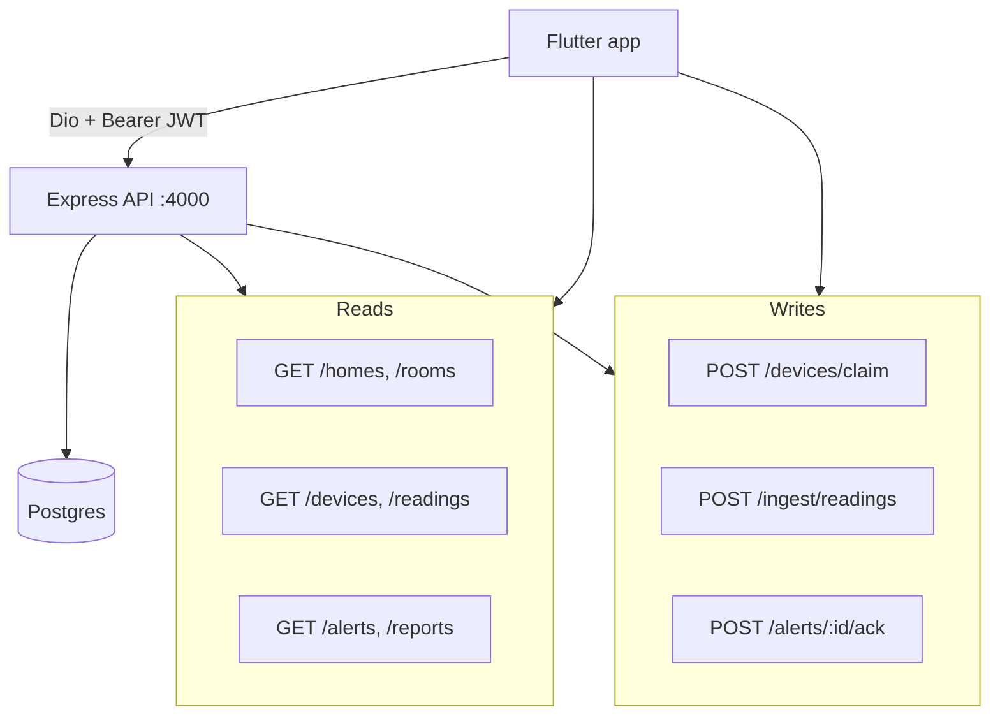
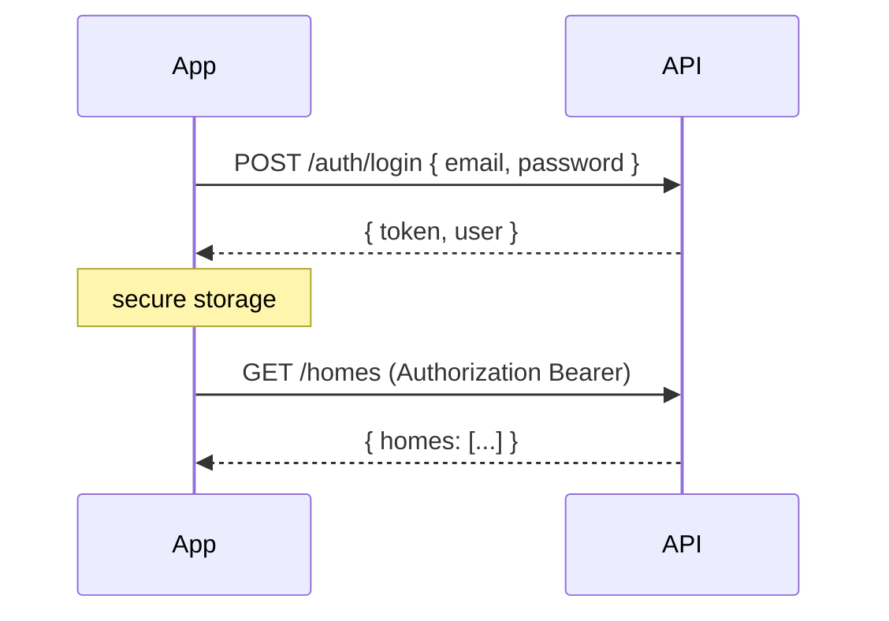
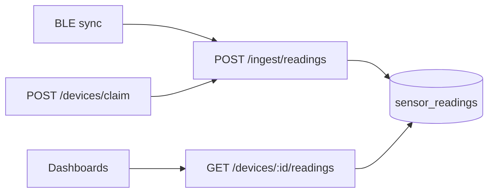
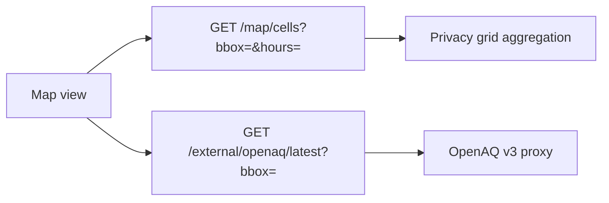

# AeroSpec Mobile — API Specification

Version: 1.0 (Phase 1)  
Backend: `apps/api` · **Authoritative contract**:
[`../../docs/PIPELINE.md`](../../docs/PIPELINE.md)

Express + TypeScript, Postgres/TimescaleDB, JWT Bearer authentication.

---

## Client ↔ API overview



## Authentication flow



---

## Base configuration

**Base URL (development)**: `http://localhost:4000`  
**Base URL (LAN demo)**: `http://192.168.68.101:4000`  
**Content-Type**: `application/json`

---

## Authentication

### POST /auth/login

Login with email and password.

**Request Body**:
```json
{
  "email": "user@example.com",
  "password": "password123"
}
```

**Response** (200 OK):
```json
{
  "token": "eyJhbGciOiJIUzI1NiIsInR5cCI6IkpXVCJ9...",
  "user": {
    "id": "user-uuid",
    "name": "John Doe",
    "email": "user@example.com",
    "role": "owner",
    "homes": ["home-uuid-1", "home-uuid-2"]
  }
}
```

**Error Responses**:
- 401: Invalid credentials
- 400: Missing or invalid fields

**Notes**:
- Store the token securely (iOS Keychain, Android Keystore)
- Include token in all subsequent requests as: `Authorization: Bearer <token>`

---

## Homes

### GET /homes

Get all homes accessible to the authenticated user.

**Headers**:
```
Authorization: Bearer <token>
```

**Response** (200 OK):
```json
{
  "homes": [
    {
      "id": "home-uuid",
      "ownerId": "user-uuid",
      "name": "My Home",
      "location": {
        "city": "Seattle",
        "region": "WA",
        "lat": 47.6062,
        "lon": -122.3321
      },
      "timezone": "America/Los_Angeles",
      "configProfileId": "profile-uuid",
      "roomIds": ["room-uuid-1", "room-uuid-2"]
    }
  ]
}
```

### GET /homes/:homeId/rooms

Get all rooms for a specific home.

**Response** (200 OK):
```json
{
  "rooms": [
    {
      "id": "room-uuid",
      "homeId": "home-uuid",
      "name": "Bedroom 1",
      "type": "Bedroom",
      "floor": "2",
      "deviceId": "device-uuid"
    }
  ]
}
```

---

## Rooms

### GET /rooms/:roomId

Get details for a specific room.

**Response** (200 OK):
```json
{
  "id": "room-uuid",
  "homeId": "home-uuid",
  "name": "Living Room",
  "type": "LivingRoom",
  "floor": "1",
  "deviceId": "device-uuid",
  "device": {
    "id": "device-uuid",
    "name": "Living Room Sensor",
    "deploymentId": "SENS-001",
    "firmwareVersion": "1.2.3",
    "status": "online",
    "lastSeen": "2025-01-22T10:30:00Z",
    "wifiRssi": -45,
    "batteryLevel": 85
  },
  "latestReading": {
    "deviceId": "device-uuid",
    "timestamp": "2025-01-22T10:30:00Z",
    "pm25": 12.5,
    "pm10": 18.3,
    "co2": 450,
    "temperature": 22.5,
    "humidity": 45,
    "pressure": 1013.25,
    "vocIndex": 120,
    "noiseDb": 35,
    "aqi": 52,
    "anomalyFlags": []
  }
}
```

---

## Devices



### POST /devices/claim (Phase 1)

Claim or create a device by serial after BLE pairing.

**Request**: `{ "serial", "name", "homeId", "roomId?" }`  
**Response**: `{ "device": { "id", ... } }` — store `device.id` for ingest.

### POST /ingest/readings (Phase 1)

Batch upload from mobile gateway. See [`PIPELINE.md`](../../docs/PIPELINE.md) §2.

### GET /devices/:deviceId/readings

Get historical sensor readings for a device.

**Query Parameters**:
- `range`: Time range for readings
  - `24h` - Last 24 hours (default)
  - `7d` - Last 7 days
  - `30d` - Last 30 days
  - `all` - All time

**Response** (200 OK):
```json
{
  "readings": [
    {
      "deviceId": "device-uuid",
      "timestamp": "2025-01-22T10:30:00Z",
      "pm25": 12.5,
      "pm10": 18.3,
      "co2": 450,
      "temperature": 22.5,
      "humidity": 45,
      "pressure": 1013.25,
      "vocIndex": 120,
      "noiseDb": 35,
      "aqi": 52,
      "anomalyFlags": []
    }
  ]
}
```

**Notes**:
- Readings are sorted by timestamp (newest first)
- Backend performs aggregation for longer ranges
- Mobile app should cache recent readings

---

## Alerts

### GET /alerts

Get alert rules and recent alert events.

**Response** (200 OK):
```json
{
  "rules": [
    {
      "id": "rule-uuid",
      "homeId": "home-uuid",
      "deviceId": null,
      "metric": "pm25",
      "thresholdType": "above",
      "thresholdValue": 35.0,
      "enabled": true,
      "notifyEmail": "user@example.com",
      "quietHours": {
        "start": "22:00",
        "end": "07:00"
      }
    }
  ],
  "events": [
    {
      "id": "event-uuid",
      "ruleId": "rule-uuid",
      "deviceId": "device-uuid",
      "timestamp": "2025-01-22T10:15:00Z",
      "metric": "pm25",
      "value": 45.2,
      "status": "open"
    }
  ]
}
```

### GET /alerts/events

Get alert events with optional filtering.

**Query Parameters**:
- `status`: Filter by status (`open`, `acknowledged`, `closed`)
- `limit`: Maximum number of events to return

**Response**: Same format as events array above

### POST /alerts/:alertId/ack

Acknowledge an alert event.

**Response** (200 OK):
```json
{
  "success": true
}
```

### POST /alerts/:alertId/dismiss

Dismiss an alert event.

**Response** (200 OK):
```json
{
  "success": true
}
```

---

## Reports

### GET /reports/weekly

Get weekly summary reports for the user's homes.

**Response** (200 OK):
```json
{
  "reports": [
    {
      "id": "report-uuid",
      "homeId": "home-uuid",
      "periodStart": "2025-01-15T00:00:00Z",
      "periodEnd": "2025-01-22T00:00:00Z",
      "generatedAt": "2025-01-22T12:00:00Z",
      "summaryStats": {
        "rooms": [
          {
            "roomId": "room-uuid",
            "avgAqi": 48,
            "maxAqi": 120,
            "maxAqiTimestamp": "2025-01-18T14:30:00Z"
          }
        ],
        "metrics": [
          {
            "metric": "pm25",
            "avgValue": 15.2,
            "maxValue": 42.5,
            "alertCount": 2
          }
        ],
        "totalAlerts": 5
      },
      "worstRoomId": "room-uuid-2",
      "link": "/reports/report-uuid"
    }
  ]
}
```

### GET /reports/:reportId

Get a specific report.

**Response**: Same format as single report object above

---

## Statistics API (Mobile-Specific)

**Note**: The following endpoints may need to be added to the backend to support mobile analytics features. These align with the Statistics tab requirements.

### GET /analytics/aqi-distribution

Get AQI band distribution for a time range.

**Query Parameters**:
- `homeId`: Home ID
- `roomId`: Optional room filter
- `range`: Time range (`day`, `week`, `month`, `all`)

**Proposed Response**:
```json
{
  "distribution": [
    {
      "band": "Good",
      "hours": 96,
      "percentage": 57
    },
    {
      "band": "Moderate",
      "hours": 48,
      "percentage": 29
    },
    {
      "band": "Unhealthy for Sensitive Groups",
      "hours": 24,
      "percentage": 14
    }
  ]
}
```

### GET /analytics/aqi-by-room

Get average AQI comparison across rooms.

**Query Parameters**:
- `homeId`: Home ID
- `range`: Time range

**Proposed Response**:
```json
{
  "rooms": [
    {
      "roomId": "room-uuid-1",
      "roomName": "Bedroom 1",
      "avgAqi": 42
    },
    {
      "roomId": "room-uuid-2",
      "roomName": "Living Room",
      "avgAqi": 56
    }
  ]
}
```

### GET /analytics/aqi-by-hour

Get AQI distribution by hour of day.

**Query Parameters**:
- `homeId`: Home ID
- `roomId`: Optional room filter
- `range`: Time range

**Proposed Response**:
```json
{
  "hourly": [
    {
      "hour": 0,
      "avgAqi": 35,
      "maxAqi": 48
    },
    {
      "hour": 1,
      "avgAqi": 32,
      "maxAqi": 42
    }
  ]
}
```

---

## Map API

Implemented on web; mobile may consume the same endpoints.



### GET /map/cells

Crowd-sourced AeroSpec readings aggregated into ~0.01° grid cells (no serials).

**Query**: `bbox=minLon,minLat,maxLon,maxLat`, `hours=24`  
**Response**: `{ cells: [{ lat, lon, deviceCount, avgPm25, avgAqi, lastTs }], total, hours }`

### GET /external/openaq/latest

Public reference stations (requires server `OPENAQ_API_KEY`).

**Query**: same `bbox` format  
**Response**: `{ stations: [{ id, name, lat, lon, pm25, aqi, lastUpdated }], total, cached }`

---

## Map API (legacy proposal — superseded)

The `/map/tiles` proposal below was never implemented. Use `/map/cells` and
`/external/openaq/latest` instead.

### GET /map/tiles (not implemented)

Get AQ data for map visualization.

**Query Parameters**:
- `bounds`: Viewport bounds (e.g., `ne_lat,ne_lon,sw_lat,sw_lon`)
- `zoom`: Map zoom level

**Proposed Response**:
```json
{
  "tiles": [
    {
      "id": "tile-h3-index",
      "center": {
        "lat": 47.6062,
        "lon": -122.3321
      },
      "aqi": 52,
      "band": "Moderate",
      "geometry": {
        "type": "Polygon",
        "coordinates": [[...]]
      }
    }
  ],
  "locations": [
    {
      "id": "location-uuid",
      "name": "University of Washington",
      "address": "Seattle, WA, USA",
      "lat": 47.6553,
      "lon": -122.3035,
      "aqi": 48
    }
  ],
  "updatedAt": "2025-01-22T10:30:00Z"
}
```

---

## Admin Endpoints (Optional for Mobile)

These endpoints exist in the web app but are likely not needed in mobile V1:

- `GET /admin/devices` - Get all devices (admin only)
- `GET /admin/stats` - Get system statistics
- `POST /admin/ota` - Initiate OTA firmware update

---

## Error Handling

All endpoints follow consistent error response format:

```json
{
  "message": "Human-readable error message",
  "error": "ERROR_CODE",
  "details": {}
}
```

**Common HTTP Status Codes**:
- `200` - Success
- `201` - Created
- `400` - Bad Request (validation error)
- `401` - Unauthorized (missing or invalid token)
- `403` - Forbidden (insufficient permissions)
- `404` - Not Found
- `500` - Internal Server Error

---

## Data Types Reference

See [../src/types/index.ts](../../sensair/src/types/index.ts) for complete TypeScript type definitions.

Key types:
- `User` - User account
- `Home` - Home/property
- `Room` - Room within a home
- `Device` - Physical sensor device
- `SensorReading` - Sensor data point
- `AlertRule` - Alert configuration
- `AlertEvent` - Triggered alert
- `ReportSummary` - Weekly summary report

---

## Rate Limiting

**To be defined**: Current implementation does not specify rate limits. Recommend:
- Auth endpoints: 5 requests/minute
- Data endpoints: 60 requests/minute
- Map endpoints: 30 requests/minute

---

## WebSocket Support (Future)

For V1, use polling with these intervals:
- Home tab (when active): Poll every 30 seconds
- Statistics tab: On-demand (user interaction)
- Map tab: On viewport change + every 5 minutes

Future WebSocket events:
- `device:reading` - New sensor reading
- `device:status` - Device online/offline
- `alert:triggered` - New alert event
