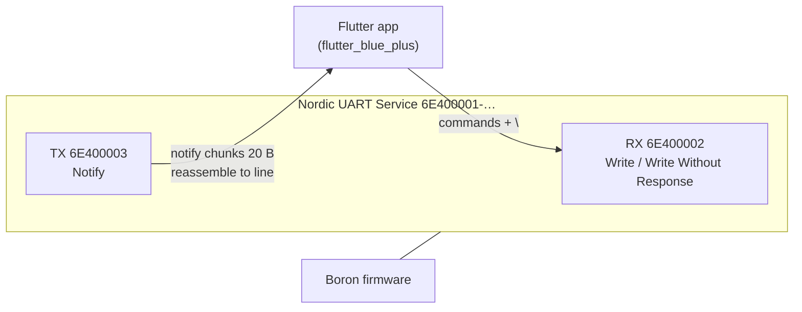
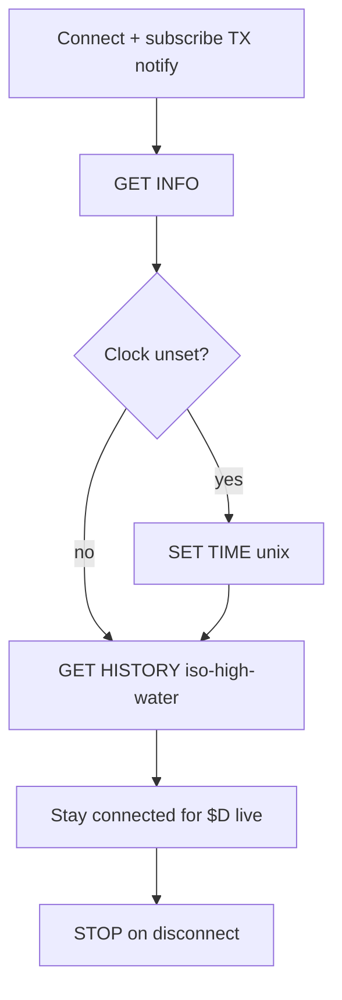
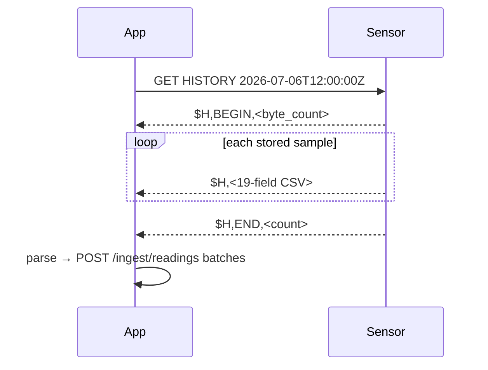
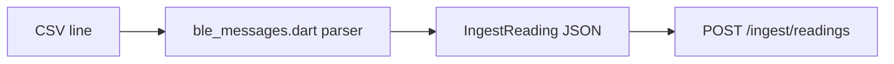
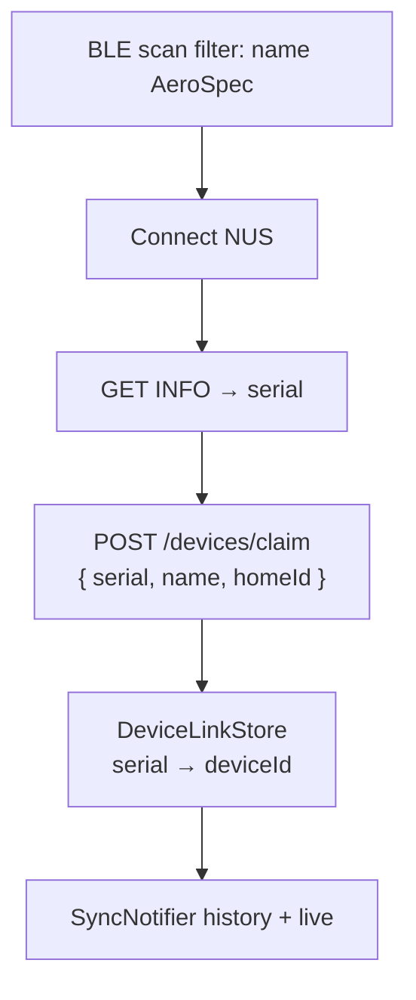
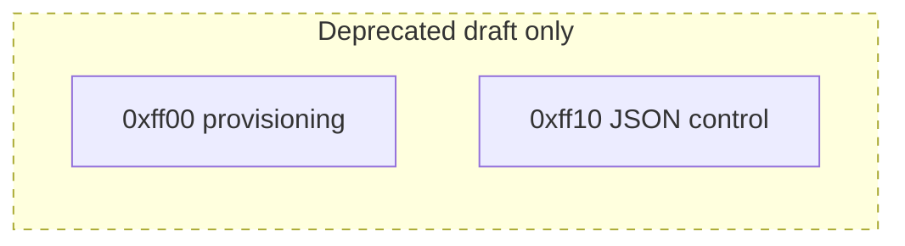

# AeroSpec Mobile — BLE Protocol (Nordic UART)

Version: 1.0 (Phase 1 implementation)  
Firmware reference: `AeroSpec-Firmware` repository README  
Binding contract: [`../../docs/PIPELINE.md`](../../docs/PIPELINE.md)

> **Note**: An earlier draft described WiFi provisioning GATT services (`0xff00`).
> That design was **not implemented**. AeroSpec hardware uses **Nordic UART
> Service (NUS)** with an ASCII line protocol.

---

## Service architecture



| Item | UUID |
|---|---|
| NUS Service | `6E400001-B5A3-F393-E0A9-E50E24DCCA9E` |
| RX (phone → device) | `6E400002-B5A3-F393-E0A9-E50E24DCCA9E` |
| TX (device → phone) | `6E400003-B5A3-F393-E0A9-E50E24DCCA9E` |

- Advertised local name: **`AeroSpec`**
- Lines: ASCII, terminated by `\n`
- Notifications arrive in **20-byte chunks** — buffer until newline before parsing

Implementation: `apps/mobile/lib/data/ble/aerospec_ble.dart`,
`ble_messages.dart`.

---

## Command set (phone → device)



| Command | Purpose |
|---|---|
| `PING` | Connectivity check |
| `GET INFO` | Firmware version, serial, battery, clock status |
| `GET LIVE` | Request live streaming mode |
| `GET HISTORY` | Stream SD-card history from high-water timestamp |
| `SET TIME <unix>` | Set RTC when unset |
| `SET INTERVAL <seconds>` | Sample interval (optional) |
| `STOP` | Stop streaming |

---

## History transfer sequence



---

## Live samples

While connected, firmware pushes **`$D,<csv>`** every sample interval (~10 s).

Same 19-column CSV as history rows (see below).

---

## CSV record format

19 columns; `NA` = missing; timestamps UTC.

```
Date(YYYY-MM-DD), Time(HH:MM:SS), Battery(V), Temp_C, RH_pct, Press_hPa,
Dp>0.3, Dp>0.5, Dp>1.0, Dp>2.5, Dp>5.0, Dp>10.0,
PM1_Std, PM2.5_Std, PM10_Std, PM1_Env, PM2.5_Env, PM10_Env, PM2.5_Corr
```



- `Dp>x` — particle counts per 0.1 L (stored as `bins[]`)
- **`PM2.5_Corr`** — humidity-corrected PM2.5; preferred for AQI
- Rows with `NA` date/time (pre-clock) are shown locally but **not uploaded**

---

## Mobile pairing + claim



---

## Platform permissions

| Platform | Requirements |
|---|---|
| iOS | `NSBluetoothAlwaysUsageDescription` in Info.plist |
| Android 12+ | `BLUETOOTH_SCAN`, `BLUETOOTH_CONNECT` |
| Android | `ACCESS_FINE_LOCATION` (BLE scan) |

---

## Appendix: deprecated WiFi provisioning draft (not implemented)

The v0.1 Sensair draft specified GATT services `0xff00` (WiFi provisioning)
and `0xff10` (JSON control). **No AeroSpec firmware or mobile code uses
this.** Kept only as historical reference — do not implement against it.



If you need the old text, see git history before Phase 1 consolidation.
