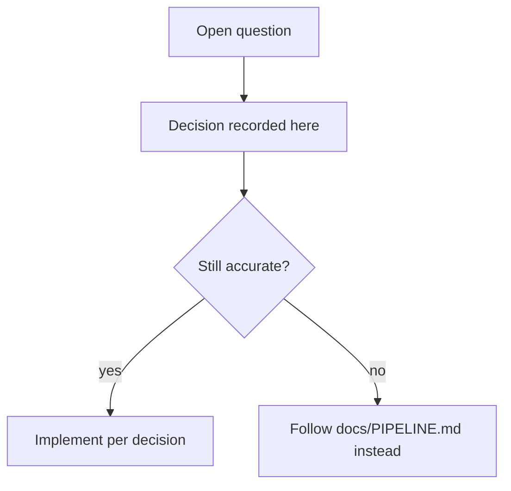

# Sensair Mobile App - Clarifications and Decisions

> **Status**: Historical (2025-01-22). Phase 1 implementation may differ.
> **Living docs**: [`../../docs/PIPELINE.md`](../../docs/PIPELINE.md),
> [`../../docs/ARCHITECTURE.md`](../../docs/ARCHITECTURE.md),
> [`BLE_PROTOCOL.md`](./BLE_PROTOCOL.md) (Nordic UART, not WiFi GATT).

Version: 0.1  
Date: 2025-01-22

This document captures clarification questions and the answers/decisions made
for the Sensair mobile app project.

---

## Architecture & Technical Decisions

### 1. Backend API Specification ✅

**Question**: Do you have existing API documentation, base URLs, authentication mechanism, and sample responses?

**Answer**:
- ✅ **Resolved**: Web app repository added to workspace
- API base: Express.js with JWT authentication
- Auth: Bearer token (`Authorization: Bearer <token>`)
- See: `docs/API_SPECIFICATION.md` for complete API documentation
- Backend repo: `d:\Projects\sensair\apps\api`
- Type definitions: `d:\Projects\sensair\src\types\index.ts`

**Implementation Notes**:
- Mobile app will use the exact same REST API as web app
- Token stored in secure storage (iOS Keychain, Android Keystore)
- Some analytics endpoints (hourly AQI, room comparisons) may need to be added to backend

---

### 2. Bluetooth Protocol ✅

**Question**: Do you have BLE protocol specifications, service UUIDs, pairing process, and Wi-Fi credential encryption?

**Answer**:
- ✅ **Created from scratch**: Custom BLE protocol designed based on IoT standards
- See: `docs/BLE_PROTOCOL.md` for complete specification
- **Decision**: Use GATT-based protocol similar to ESP32 WiFi provisioning
- **Two main services**:
  1. Device Provisioning Service (0xff00) - For setup and WiFi config
  2. Device Control Service (0xff10) - For live data and control
- **Security**: V1 uses BLE link-layer encryption, V2+ will add AES encryption for WiFi password

**Implementation Notes**:
- Mobile app will scan for service UUID `0xff00`
- WiFi credentials sent as JSON over BLE characteristic `0xff03`
- Device connects to cloud using claim token provided by mobile app
- When nearby, prefer BLE for faster control; fallback to cloud API when out of range

---

### 3. Real-time Updates ✅

**Question**: Should we prioritize WebSockets/SSE or start with polling?

**Answer**:
- ✅ **Decision**: Start with polling for V1
- **Polling intervals**:
  - Home tab (active): Every 30 seconds
  - Statistics tab: On-demand (user interaction)
  - Map tab: On viewport change + every 5 minutes
- **Future**: Add WebSocket support in V2 for push-based updates

---

## Design & Assets

### 4. Design Assets ✅

**Question**: Are design screenshots, Figma files, color palettes available?

**Answer**:
- ✅ **Provided**: Design inspiration screenshots shared
- ✅ **Created**: Comprehensive design system documented
- See: `docs/DESIGN_SYSTEM.md` for complete design specification
- Screenshots saved in: `docs/design-screenshots/`
- **Key decisions**:
  - Primary color: Teal/Cyan (#26D0CE)
  - Gradient headers (blue/teal)
  - AQI colors follow EPA standard
  - Support light and dark themes

---

### 5. Icons and Branding ✅

**Question**: Do you have app icons, logo assets, or brand guidelines?

**Answer**:
- ❌ **Not available yet**: No official app icon or logo
- ✅ **Decision**: Use Material Symbols (Android/cross-platform) or SF Symbols (iOS)
- ✅ **Decision**: Design metric icons with simple, clean style (cloud, temp, humidity icons)
- **Action**: Designer can create custom icons later; use stock icons for MVP

**Implementation Notes**:
- Use icon libraries: Material Symbols, SF Symbols
- For metric icons: Use semantic icons (thermometer for temp, water drop for humidity, etc.)
- Placeholder app icon: Use teal gradient with "S" or air quality icon

---

## Data Models & Business Logic

### 6. AQI Calculation ✅

**Question**: Is AQI calculated on backend or mobile? Which standard?

**Answer**:
- ✅ **Resolved**: Backend calculates AQI and includes it in `SensorReading` object
- ✅ **Standard**: US EPA AQI (confirmed in `src/utils/aqi.ts`)
- **Breakpoints**:
  - 0-50: Good (green)
  - 51-100: Moderate (yellow)
  - 101-150: Unhealthy for Sensitive Groups (orange)
  - 151-200: Unhealthy (red)
  - 201-300: Very Unhealthy (purple)
  - 301-500: Hazardous (maroon)

**Implementation Notes**:
- Mobile app receives pre-calculated AQI value
- Mobile app can optionally recalculate for display purposes using same algorithm
- See `src/utils/aqi.ts` for reference implementation

---

### 7. Multi-room/Multi-device Logic ✅

**Question**: Can a single device serve multiple rooms? What's the aggregation logic for home AQI?

**Answer**:
- ✅ **Confirmed**: 1:1 relationship in V1 (one device per room)
- ✅ **Decision**: Aggregated home AQI = worst room AQI (most conservative approach)
- **Alternative**: Could use average AQI, but "worst room" is better for health safety

**Implementation Notes**:
- Type definition confirms: `Room.deviceId` (singular, 1:1)
- Home screen shows aggregated AQI from all rooms
- "Worst room" shown prominently to alert user

---

### 8. Alert Rules ✅

**Question**: Are alert thresholds configured per-user, per-device, or global? How are push notifications handled?

**Answer**:
- ✅ **Confirmed**: Alert rules can be scoped to:
  - Home level (`homeId` set, applies to all devices in home)
  - Device level (`deviceId` set, applies to specific device)
- ✅ **Push notifications**: Backend sends alerts, mobile app displays them
- **Quiet hours**: Supported via `QuietHours` object (start/end time)

**Implementation Notes**:
- Mobile app should support local push notification registration
- Use Firebase Cloud Messaging (FCM) for both iOS and Android
- Backend triggers push when alert rule violated
- Mobile app handles notification tap → open alert detail

---

## Scope Clarifications

### 9. Map Data Source ✅

**Question**: Is crowdsourced map from Sensair users only? Or integrated with public AQ sources? What format?

**Answer**:
- 🟡 **Partial answer**: Web app has map infrastructure
- ✅ **Decision**: For V1, assume Sensair users only (simpler data model)
- ✅ **Proposed format**: Hex tiles (H3) or polygons with AQI values
- See `docs/API_SPECIFICATION.md` - proposed `/map/tiles` endpoint
- **Future**: Could integrate EPA, PurpleAir, or other public sources

**Implementation Notes**:
- Mobile app requests tiles based on viewport bounds
- Backend returns polygons (GeoJSON format)
- Color polygons by AQI band
- Bottom sheet shows nearby locations with AQI values

---

### 10. Framework Choice ✅

**Question**: Flutter preferred, but should I make the final decision?

**Answer**:
- ✅ **Decision**: **Use Flutter**
- **Rationale**:
  1. Preferred by stakeholder
  2. Single codebase for iOS + Android
  3. Excellent BLE support (flutter_blue_plus)
  4. Good mapping libraries (google_maps_flutter, mapbox_gl)
  5. Strong state management options (Riverpod, Bloc)
  6. Fast development cycle

**Implementation Notes**:
- Use Flutter 3.x (latest stable)
- State management: Riverpod (recommended) or Bloc
- BLE: flutter_blue_plus or flutter_reactive_ble
- HTTP: dio or http package
- Secure storage: flutter_secure_storage
- Maps: google_maps_flutter or mapbox_gl

---

### 11. Testing Requirements ✅

**Question**: What's the expected test coverage? E2E tests or unit/widget tests?

**Answer**:
- ✅ **Decision**: Focus on unit and widget tests for V1
- **Coverage target**: 70%+ for business logic and data layers
- **Testing strategy**:
  - Unit tests: Data models, repositories, utilities
  - Widget tests: Key screens (Home, Statistics, Map, onboarding)
  - Integration tests: BLE setup flow (manual test plan if not automatable)
  - E2E tests: Optional, can be added in V2

**Implementation Notes**:
- Use Flutter's built-in test framework
- Mock API responses for testing
- Mock BLE peripherals for testing setup flow
- CI should run tests on every commit

---

### 12. Firmware Updates ✅

**Question**: Is OTA firmware update via mobile app in scope for V1? If yes, what's the mechanism?

**Answer**:
- ✅ **Confirmed**: OTA infrastructure exists in web app (`/admin/ota` endpoint)
- ✅ **Decision**: For V1, **notify user of available update, device downloads from cloud**
- **V1 flow**:
  1. Backend checks for firmware update
  2. Mobile app shows notification: "Firmware update available"
  3. User taps "Update"
  4. Mobile app tells backend to trigger OTA for device
  5. Device downloads firmware from cloud (not via BLE)
  6. Mobile app polls status and shows progress
- **V2+**: Add BLE-based firmware transfer (larger scope)

**Implementation Notes**:
- Check `Device.firmwareVersion` against latest available
- Show badge/banner in device detail if update available
- Use existing `/admin/ota` endpoint (may need non-admin version)
- Show progress UI while device updates

---

## Timeline & Prioritization

### 13. MVP Definition ✅

**Question**: If we need to cut scope, what's the priority order of tabs?

**Answer**:
- ✅ **Confirmed priority**:
  1. **Home** (CRITICAL) - Device setup (BLE), current readings, device list
  2. **Profile** (CRITICAL) - Auth, settings, logout
  3. **Statistics** (HIGH) - Historical data, trends, insights
  4. **Map** (MEDIUM) - Crowdsourced AQ map, can be phase 2
- **Rationale**: Users need to set up devices and view current data (Home + Profile). Statistics add significant value. Map is nice-to-have.

**Milestones**:
- **M1 (MVP Core)**: Auth + Home + Profile (2-3 weeks)
- **M2 (Full V1)**: + Statistics + Map (1-2 weeks)
- **M3 (Polish)**: Animations, dark mode, accessibility (1 week)

---

### 14. Bluetooth Setup Priority ✅

**Question**: Should BLE setup be first milestone (riskiest) or build cloud features first?

**Answer**:
- ✅ **Decision**: **BLE setup should be early milestone, but not first**
- **Recommended order**:
  1. **Week 1**: Project setup, auth, API integration, basic Home UI (cloud-based)
  2. **Week 2**: BLE scanning, pairing, WiFi provisioning (test with simulator/mock)
  3. **Week 3**: Device detail, Statistics tab, polish
  4. **Week 4**: Map tab, final testing, bug fixes

**Rationale**:
- Validate API integration and UI first (de-risk)
- BLE can be tested with simulators/mock devices
- Hardware dependency shouldn't block other progress

---

## Additional Decisions

### 15. Multi-Home Support ✅

**Decision**: V1 supports multiple homes (backend already supports it)
- User can have multiple homes
- Home selector in Profile tab
- Default to first home on app launch
- Future: Quick switcher in Home tab header

---

### 16. Offline Behavior ✅

**Decision**: Simple caching for V1
- Cache last readings for each device
- Show cached data with "Last updated" timestamp
- Display "Offline" banner when network unavailable
- Allow read-only access to cached data
- No complex offline-first sync in V1

---

### 17. Analytics Events ✅

**Decision**: Track key events for product analytics
- Use Firebase Analytics or Mixpanel
- Events to track:
  - Login success/failure
  - Device added/removed
  - Alerts viewed/acknowledged
  - Map searches
  - Time range changes in Statistics
  - Screen views
- Ensure PII compliance (no email, names, etc.)

---

### 18. Localization ✅

**Decision**: V1 supports English only
- Set up i18n infrastructure (Flutter Intl)
- All strings externalized
- Future: Add Spanish, Chinese, etc. based on user base

---

### 19. Permission Handling ✅

**Decision**: Request permissions just-in-time
- BLE + Location: When user taps "Add Device"
- Notifications: After first device setup (or in Profile)
- Location (map): When user opens Map tab
- Camera (future): For QR code scanning if implemented

---

## Open Questions / Future Work

These items are deferred to V2 or later:

1. **Social features**: Sharing AQ snapshots
2. **Widgets**: iOS home screen widgets, Android widgets
3. **Smart home integration**: HomeKit, Google Home, Alexa
4. **Advanced ML insights**: Health correlations, predictions
5. **Multi-language support**: Spanish, Chinese, etc.
6. **Accessibility audit**: WCAG AAA compliance
7. **Tablet optimization**: Larger screen layouts
8. **Apple Watch / Wear OS**: Companion apps

---

## Summary for Implementation

### What's Clear ✅
- Framework: Flutter
- API: Existing backend with JWT auth
- BLE: Custom GATT protocol (documented)
- Design: Comprehensive design system (documented)
- AQI: EPA standard, calculated on backend
- Priority: Home > Profile > Statistics > Map
- Testing: Unit + widget tests, 70% coverage
- Notifications: Firebase Cloud Messaging
- Polling: 30s on Home tab (active)

### What's Flexible 🟡
- Map data format (proposed H3 tiles, can adjust)
- Analytics provider (Firebase or Mixpel)
- State management (Riverpod recommended)
- Some API endpoints may need to be added (analytics, map)

### What's Deferred 🔜
- Multi-language support (V2)
- WebSocket updates (V2)
- BLE firmware updates (V2)
- Social features (Future)
- Smart home integration (Future)

---

## Action Items for Claude Code

When implementing, refer to:
1. `sensair_mobile_prd.md` - Product requirements
2. `sensair_mobile_todo.md` - Task checklist
3. `docs/API_SPECIFICATION.md` - API endpoints and data models
4. `docs/BLE_PROTOCOL.md` - Bluetooth protocol
5. `docs/DESIGN_SYSTEM.md` - Visual design and components
6. This document - Clarifications and decisions

**Backend codebase**: `d:\Projects\sensair\`
**Mobile app codebase**: `d:\Projects\sensair-app\`

Good luck! 🚀
