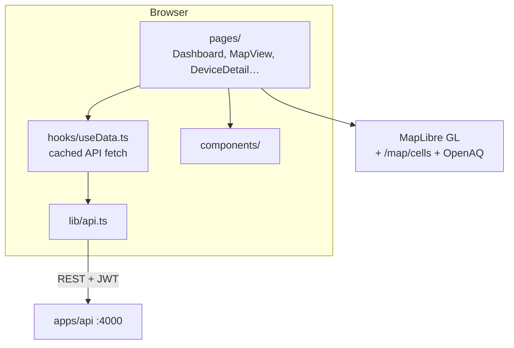

# AeroSpec Web Dashboard

React + Vite SPA: home overview, device detail, room comparison, regional map
(MapLibre + OpenAQ overlay), alerts, reports, admin.

**API contract**: [`docs/PIPELINE.md`](../../docs/PIPELINE.md) · **Diagrams**:
[`docs/ARCHITECTURE.md`](../../docs/ARCHITECTURE.md) · **Design tokens**:
[`README_DESIGN.md`](./README_DESIGN.md)

## Architecture



## Quick start

```bash
pnpm install              # repo root
pnpm dev                  # http://localhost:5173 (proxies API)
pnpm --filter @aerospec/web build
```

Docker (production build baked with `VITE_API_URL`):

```bash
docker compose up -d web
# http://localhost:8080
```

## Key pages

| Route | Component | Data |
|---|---|---|
| `/` | Dashboard | `GET /devices`, `/homes`, rooms |
| `/map` | MapView | `GET /map/cells`, `/external/openaq/latest` |
| `/devices/:id` | DeviceDetail | `GET /devices/:id/readings?range=` |
| `/compare` | CompareRooms | per-device readings |
| `/login` | Login | `POST /auth/login` |

Demo: `admin@aerospec.io` / `aerospec-admin`

## Tests

```bash
pnpm --filter @aerospec/web exec vitest run
```
