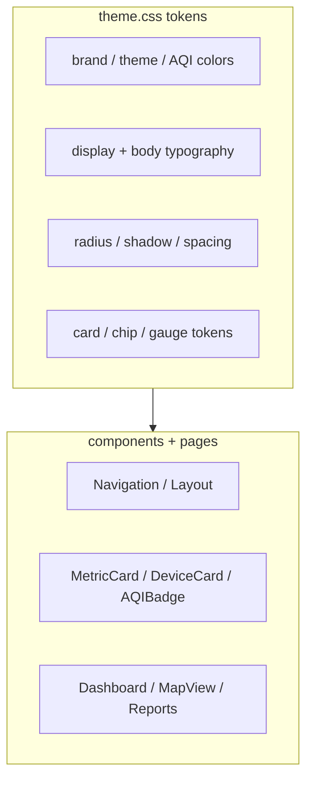

# AeroSpec Web - Design System

Visual design tokens for the React dashboard. For architecture and data flow,
see [`README.md`](./README.md) and [`../../docs/ARCHITECTURE.md`](../../docs/ARCHITECTURE.md).



## Direction

AeroSpec uses a bright mint and teal system with an accessible split primary:
decorative bright teal for gradients and large visual accents, and a darker
interactive teal for small text, controls, and focus states in light mode.
Dark mode moves to a teal-black background family and flips the interactive
primary to bright teal.

## Typography

The display face is Plus Jakarta Sans. It is used for headings, large metrics,
and display numerals. Body text stays on Work Sans for dense dashboard copy,
labels, and controls.

```css
--font-display: 'Plus Jakarta Sans', sans-serif;
--font-body: 'Work Sans', sans-serif;
--font-mono: 'SF Mono', 'Monaco', 'Consolas', monospace;
```

The active type scale is defined in `theme.css`:

```css
--text-xs: 0.64rem;
--text-sm: 0.8rem;
--text-base: 1rem;
--text-lg: 1.25rem;
--text-xl: 1.563rem;
--text-2xl: 1.953rem;
--text-3xl: 2.441rem;
--text-4xl: 3.052rem;
```

## Color Tokens

### Brand

```css
--color-primary: #12777C;        /* Light theme interactive primary */
--color-primary-bright: #26D0CE; /* Decorative teal */
--color-primary-light: #1A9BA1;
--color-primary-dark: #0B565A;
--color-primary-surface: #DFF6F5;
```

Use `--color-primary` for links, focus rings, borders, primary buttons, and
other interactive states. Use `--color-primary-bright` for gradients,
illustrations, large display numerals, and active-state glows. Do not use the
bright teal as small text on white or as a small white-text button fill.

Measured contrast documented in `theme.css`:

- `#12777C` on white: 5.31:1
- White on `#12777C`: 5.31:1
- `#F4FBFB` on dark background `#0B1D1E`: 16.58:1
- `#26D0CE` on dark background `#0B1D1E`: 9.10:1

### Gradients

```css
--gradient-hero: linear-gradient(135deg, #26D0CE 0%, #1A9BA1 60%, #12777C 100%);
--gradient-mint: linear-gradient(145deg, rgba(38, 208, 206, 0.16) 0%, rgba(255, 255, 255, 0.92) 58%, rgba(223, 246, 245, 0.74) 100%);
```

`--gradient-hero` is the bright brand gradient. `--gradient-mint` is a soft
surface treatment for elevated cards and panels.

### Themes

```css
/* Light */
--color-background: #F7FCFC;
--color-surface: #FFFFFF;
--color-surface-elevated: #FFFFFF;
--color-text-primary: #102A2C;
--color-border: #DCEAEA;

/* Dark */
--color-background: #0B1D1E;
--color-surface: #102D2F;
--color-surface-elevated: #163D40;
--color-text-primary: #F4FBFB;
--color-border: #245659;
```

The app supports explicit `light` and `dark` values on `data-theme`, plus auto
dark mode via `prefers-color-scheme`.

### AQI Bands

EPA AQI band colors remain stable across themes. Each band also has a soft
variant for hexagon fills, badges, and chip backgrounds.

```css
--color-aqi-good: #00E400;
--color-aqi-good-soft: rgba(0, 228, 0, 0.24);
--color-aqi-moderate: #FFFF00;
--color-aqi-moderate-soft: rgba(255, 255, 0, 0.28);
--color-aqi-sensitive: #FF7E00;
--color-aqi-sensitive-soft: rgba(255, 126, 0, 0.24);
--color-aqi-unhealthy: #FF0000;
--color-aqi-unhealthy-soft: rgba(255, 0, 0, 0.22);
--color-aqi-very-unhealthy: #8F3F97;
--color-aqi-very-unhealthy-soft: rgba(143, 63, 151, 0.24);
--color-aqi-hazardous: #7E0023;
--color-aqi-hazardous-soft: rgba(126, 0, 35, 0.24);
```

## Shape And Elevation

Cards are 16px by default, large cards and hero surfaces are 24px, pill
buttons and chips use the full radius, and hero headers can use the dedicated
28px bottom-corner token.

```css
--radius-sm: 8px;
--radius-md: 12px;
--radius-lg: 16px;
--radius-xl: 24px;
--radius-2xl: 28px;
--radius-hero: 0 0 28px 28px;
--radius-full: 9999px;
```

Shadows are soft, low-opacity, and teal-tinted in light mode. Dark mode keeps
depth visible with darker shadows plus subtle mint glow.

```css
--shadow-sm: 0 2px 6px rgba(18, 119, 124, 0.08);
--shadow-md: 0 10px 24px rgba(18, 119, 124, 0.1), 0 2px 8px rgba(10, 31, 32, 0.04);
--shadow-lg: 0 18px 42px rgba(18, 119, 124, 0.14), 0 6px 16px rgba(10, 31, 32, 0.06);
--shadow-xl: 0 28px 64px rgba(18, 119, 124, 0.18), 0 10px 24px rgba(10, 31, 32, 0.08);
```

## Component Tokens

```css
--card-bg: var(--color-surface);
--chip-bg: rgba(38, 208, 206, 0.14);
--gauge-track: rgba(18, 119, 124, 0.16);
```

Prefer these component tokens when adding new cards, chips, and gauges so
theme behavior remains centralized.

## Accessibility

Normal text should meet WCAG AA 4.5:1. The light interactive primary was chosen
because it passes both primary text on white and white text on a primary fill.
Focus rings use `--color-border-focus`, which resolves to the active primary
for the current theme.
