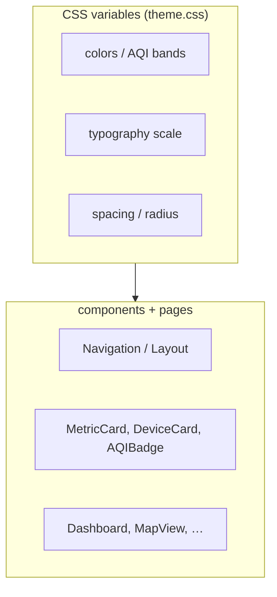

# AeroSpec Web — Design System

Visual design tokens for the React dashboard. For architecture and data flow,
see [`README.md`](./README.md) and [`../../docs/ARCHITECTURE.md`](../../docs/ARCHITECTURE.md).



## Design philosophy

### Purpose & Tone

Sensair's design balances **technical precision** with **approachable clarity**. The interface should feel:

- **Professional yet welcoming** - Scientific accuracy without intimidation
- **Clean and spacious** - Generous white space, thoughtful hierarchy
- **Subtly sophisticated** - Refined details without over-design
- **Data-forward** - Charts and metrics are the hero, not decoration

The aesthetic draws inspiration from modern SaaS dashboards and environmental monitoring tools, with a focus on legibility and data visualization.

---

## Typography

### Font Families

The design uses a dual-font system:

**Primary Font (UI Text):**
- Family: System font stack
- Stack: `-apple-system, BlinkMacSystemFont, 'Segoe UI', Roboto, Oxygen, Ubuntu, Cantarell, sans-serif`
- Usage: Body text, labels, navigation, controls
- Rationale: Native system fonts provide optimal legibility and performance

**Display Font (Numbers & Headers):**
- Family: System font stack with geometric bias
- Usage: Large numbers (AQI values, metrics), hero headings
- Rationale: Tabular figures for consistent alignment in data displays

### Type Scale

Defined in CSS custom properties:

```css
--text-xs: 0.75rem;      /* 12px - Labels, captions */
--text-sm: 0.875rem;     /* 14px - Secondary text */
--text-base: 1rem;       /* 16px - Body text */
--text-lg: 1.125rem;     /* 18px - Emphasized text */
--text-xl: 1.5rem;       /* 24px - Section headers */
--text-2xl: 2rem;        /* 32px - Page titles */
--text-3xl: 2.5rem;      /* 40px - Hero values */
```

### Font Weights

- **400 (Regular)**: Body text, descriptions
- **500 (Medium)**: Emphasized text, labels
- **600 (Semibold)**: Subheadings, button text
- **700 (Bold)**: Headings, important metrics

---

## Color Palette

### Primary Colors

The color system is built around a calming teal/cyan palette that evokes air, water, and environmental clarity.

```css
/* Primary (Teal/Cyan) */
--color-primary: #14ABAF;           /* Main brand color */
--color-primary-light: #5BC7CA;     /* Hover states, accents */
--color-primary-dark: #0D7377;      /* Active states, emphasis */

/* Neutrals */
--color-gray-50: #F9FAFB;
--color-gray-100: #F3F4F6;
--color-gray-200: #E5E7EB;
--color-gray-300: #D1D5DB;
--color-gray-400: #9CA3AF;
--color-gray-500: #6B7280;
--color-gray-600: #4B5563;
--color-gray-700: #374151;
--color-gray-800: #1F2937;
--color-gray-900: #111827;
```

### Semantic Colors

```css
/* Success (Green) */
--color-success: #10B981;
--color-success-light: #34D399;
--color-success-dark: #059669;

/* Warning (Amber) */
--color-warning: #F59E0B;
--color-warning-light: #FCD34D;
--color-warning-dark: #D97706;

/* Error (Red) */
--color-error: #EF4444;
--color-error-light: #F87171;
--color-error-dark: #DC2626;

/* Info (Blue) */
--color-info: #3B82F6;
--color-info-light: #60A5FA;
--color-info-dark: #2563EB;
```

### AQI-Specific Colors

Air quality bands follow EPA standards:

```css
--aqi-good: #10B981;        /* 0-50: Green */
--aqi-moderate: #F59E0B;    /* 51-100: Yellow */
--aqi-unhealthy-sg: #F97316; /* 101-150: Orange */
--aqi-unhealthy: #EF4444;   /* 151-200: Red */
--aqi-very-unhealthy: #8B5CF6; /* 201-300: Purple */
--aqi-hazardous: #7C2D12;   /* 301+: Maroon */
```

### Theme Colors (Light/Dark)

```css
/* Light Mode */
--color-background: #FFFFFF;
--color-surface: #F9FAFB;
--color-border: #E5E7EB;
--color-text-primary: #111827;
--color-text-secondary: #6B7280;
--color-text-tertiary: #9CA3AF;

/* Dark Mode */
--color-background: #0F172A;
--color-surface: #1E293B;
--color-border: #334155;
--color-text-primary: #F8FAFC;
--color-text-secondary: #CBD5E1;
--color-text-tertiary: #94A3B8;
```

---

## Spacing & Layout

### Spacing Scale

Consistent spacing using a 4px base unit:

```css
--space-1: 0.25rem;   /* 4px */
--space-2: 0.5rem;    /* 8px */
--space-3: 0.75rem;   /* 12px */
--space-4: 1rem;      /* 16px */
--space-5: 1.25rem;   /* 20px */
--space-6: 1.5rem;    /* 24px */
--space-8: 2rem;      /* 32px */
--space-10: 2.5rem;   /* 40px */
--space-12: 3rem;     /* 48px */
--space-16: 4rem;     /* 64px */
```

### Border Radius

Rounded corners create a friendly, modern feel:

```css
--radius-sm: 0.25rem;   /* 4px - Badges, small elements */
--radius-md: 0.5rem;    /* 8px - Buttons, inputs */
--radius-lg: 0.75rem;   /* 12px - Cards, panels */
--radius-xl: 1rem;      /* 16px - Large containers */
--radius-2xl: 1.5rem;   /* 24px - Modal dialogs */
--radius-full: 9999px;  /* Pills, circular elements */
```

### Shadows

Subtle shadows for depth and hierarchy:

```css
--shadow-sm: 0 1px 2px rgba(0, 0, 0, 0.05);
--shadow-md: 0 4px 6px rgba(0, 0, 0, 0.07);
--shadow-lg: 0 10px 15px rgba(0, 0, 0, 0.1);
--shadow-xl: 0 20px 25px rgba(0, 0, 0, 0.15);
```

---

## Animation & Motion

### Transition Speeds

```css
--transition-fast: 150ms ease-in-out;
--transition-base: 250ms ease-in-out;
--transition-slow: 350ms ease-in-out;
```

### Motion Principles

1. **Purposeful**: Animations guide attention, don't distract
2. **Subtle**: Gentle transitions, avoid jarring movements
3. **Responsive**: Immediate feedback for user interactions
4. **Performant**: GPU-accelerated transforms and opacity only

### Common Patterns

**Hover States:**
```css
.card:hover {
  transform: translateY(-3px);
  box-shadow: var(--shadow-lg);
  transition: all var(--transition-fast);
}
```

**Loading States:**
- Skeleton screens with shimmer effect
- Spinner for short waits (<2s)
- Progress indicators for longer operations

**Page Transitions:**
- Fade in content (200ms)
- Stagger child elements (50ms delay)

---

## Component Patterns

### Cards

Cards are the primary content container:

```css
.card {
  background: linear-gradient(180deg, rgba(255,255,255,0.82), rgba(255,255,255,0.72));
  border: 1px solid var(--color-border);
  border-radius: var(--radius-lg);
  padding: var(--space-6);
  box-shadow: var(--shadow-md);
}
```

**Variations:**
- Standard card: Default container
- Stat card: Highlighted metrics
- Interactive card: Hover effects, clickable
- Glass card: Translucent overlay effect

### Buttons

```css
/* Primary */
.button-primary {
  background: var(--color-primary);
  color: white;
  padding: 0.75rem 1.25rem;
  border-radius: var(--radius-md);
  font-weight: 600;
}

/* Secondary */
.button-secondary {
  background: transparent;
  border: 1px solid var(--color-border);
  color: var(--color-text-primary);
}
```

### Badges

```css
.badge {
  display: inline-flex;
  align-items: center;
  padding: 0.25rem 0.75rem;
  border-radius: var(--radius-full);
  font-size: var(--text-xs);
  font-weight: 600;
}
```

**Types:**
- AQI badges (color-coded by band)
- Status badges (online/offline)
- Alert badges (count indicators)

---

## Theming System

### Theme Toggle

Users can select from three modes:
- **Light**: Bright background, dark text
- **Dark**: Dark background, light text
- **Auto**: Follows system preference (`prefers-color-scheme`)

### Implementation

Themes are applied via CSS custom properties and a `data-theme` attribute on the root element:

```css
[data-theme="light"] {
  --color-background: #FFFFFF;
  --color-text-primary: #111827;
  /* ...other light mode variables */
}

[data-theme="dark"] {
  --color-background: #0F172A;
  --color-text-primary: #F8FAFC;
  /* ...other dark mode variables */
}
```

JavaScript hook (`useTheme`) manages theme state and persistence.

---

## Accessibility

### Contrast

All text meets WCAG AA standards:
- Normal text: 4.5:1 minimum
- Large text: 3:1 minimum
- Interactive elements: 3:1 minimum

### Focus States

Visible focus indicators for keyboard navigation:

```css
.interactive-element:focus-visible {
  outline: 2px solid var(--color-primary);
  outline-offset: 2px;
}
```

### Screen Reader Support

- Semantic HTML elements
- ARIA labels on charts and icons
- Skip links for navigation
- Proper heading hierarchy

---

## Chart Styling

### Colors

Charts use a consistent palette for data series:

```css
--chart-color-1: #6366F1; /* Indigo */
--chart-color-2: #EC4899; /* Pink */
--chart-color-3: #14B8A6; /* Teal */
--chart-color-4: #F97316; /* Orange */
--chart-color-5: #8B5CF6; /* Purple */
```

### Styling Guidelines

- Grid lines: `#E5E7EB` (light), `#334155` (dark)
- Axes: Subtle, unobtrusive
- Tooltips: White background, subtle shadow
- Line thickness: 2px for main series
- Points: Hidden unless hovering

---

## Responsive Design

### Breakpoints

```css
--breakpoint-sm: 640px;   /* Mobile landscape */
--breakpoint-md: 768px;   /* Tablet portrait */
--breakpoint-lg: 1024px;  /* Tablet landscape */
--breakpoint-xl: 1280px;  /* Desktop */
--breakpoint-2xl: 1536px; /* Large desktop */
```

### Mobile-First Approach

Start with mobile styles, progressively enhance:

```css
/* Mobile */
.grid {
  grid-template-columns: 1fr;
}

/* Tablet and up */
@media (min-width: 768px) {
  .grid {
    grid-template-columns: repeat(2, 1fr);
  }
}

/* Desktop and up */
@media (min-width: 1024px) {
  .grid {
    grid-template-columns: repeat(3, 1fr);
  }
}
```

---

## Design Principles Summary

1. **Clarity over cleverness**: Prioritize readability and understanding
2. **Data visualization first**: Let metrics speak, minimize chrome
3. **Consistent patterns**: Reuse components and styles
4. **Progressive disclosure**: Show essentials first, details on demand
5. **Accessibility always**: Design for all users from the start

---

## Future Enhancements

Potential improvements for future iterations:

- Custom data visualization components
- Advanced theming (custom color schemes)
- Motion preference support (`prefers-reduced-motion`)
- High contrast mode
- Printable reports styling
- Export/share styled previews
