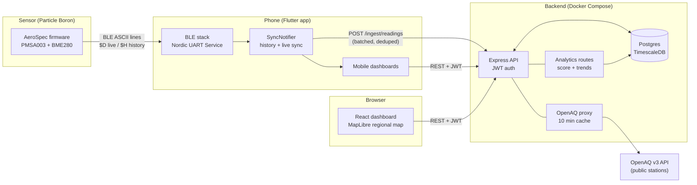
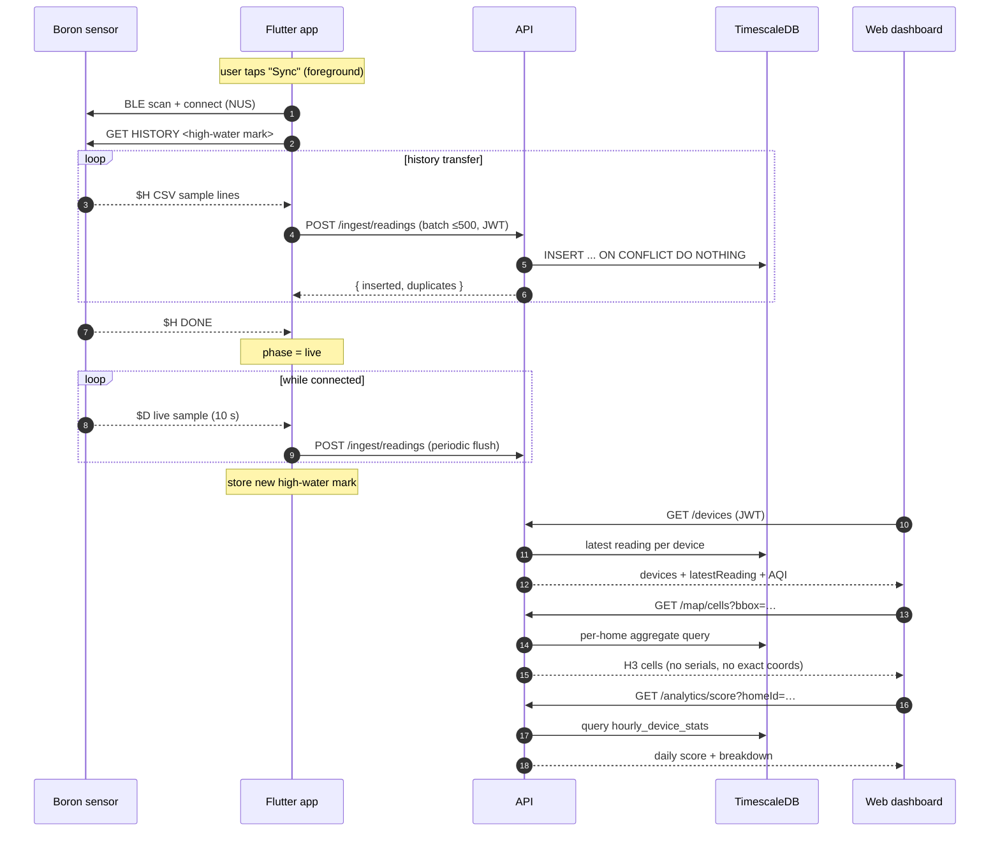
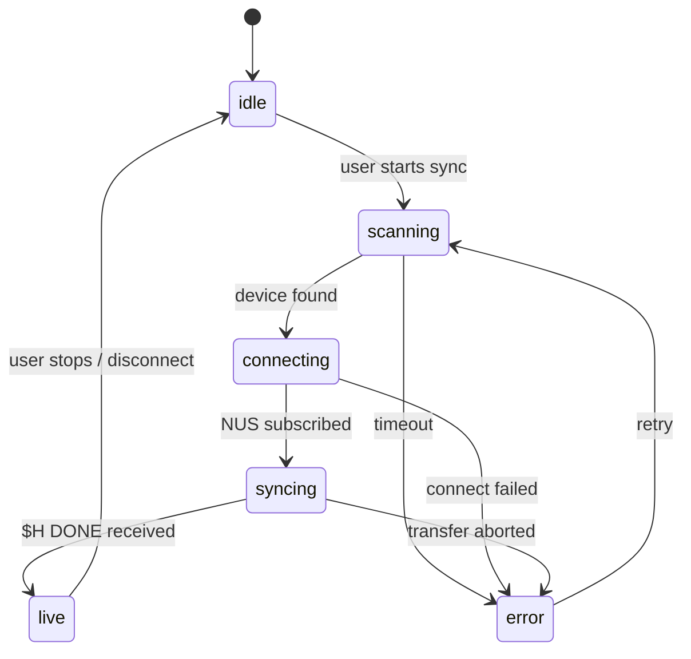
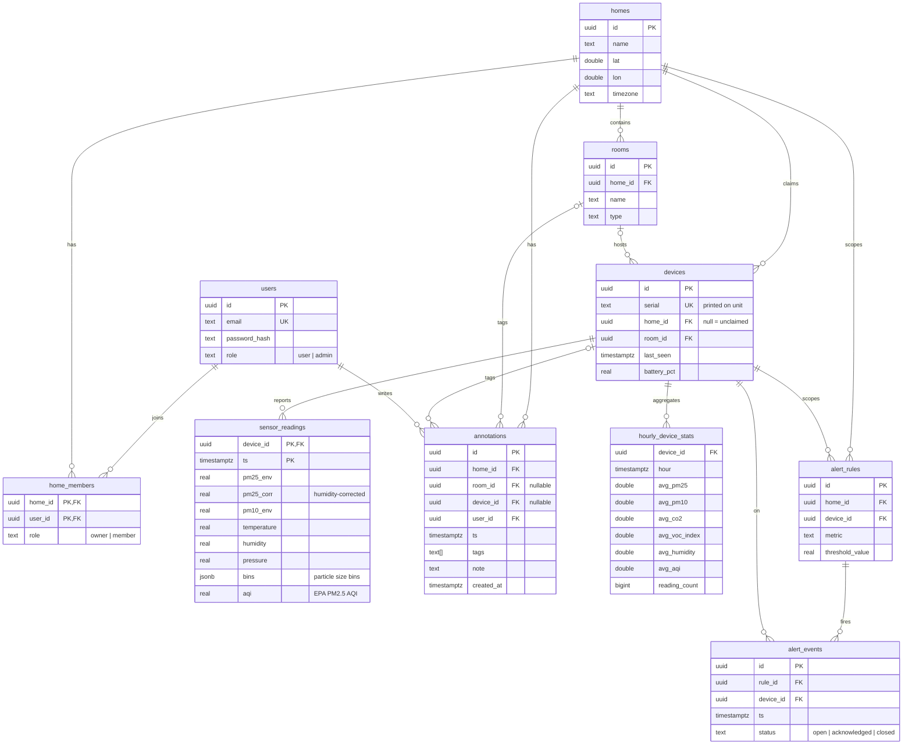
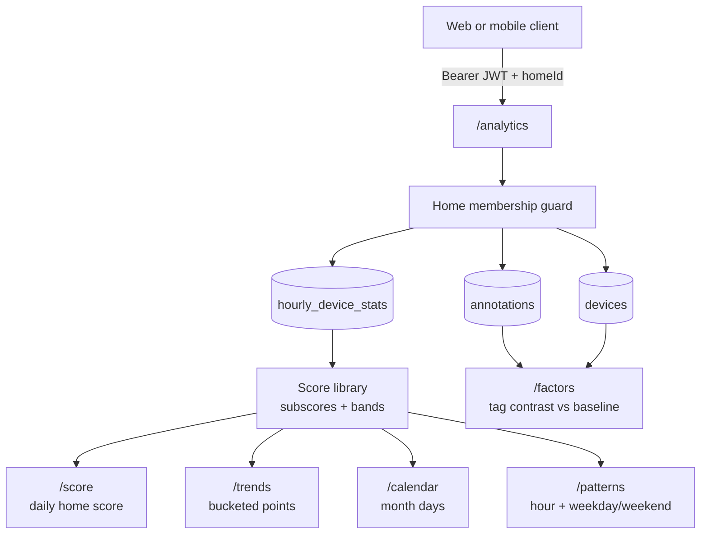
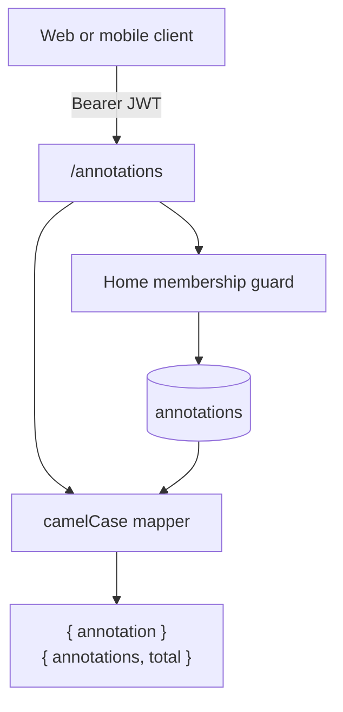
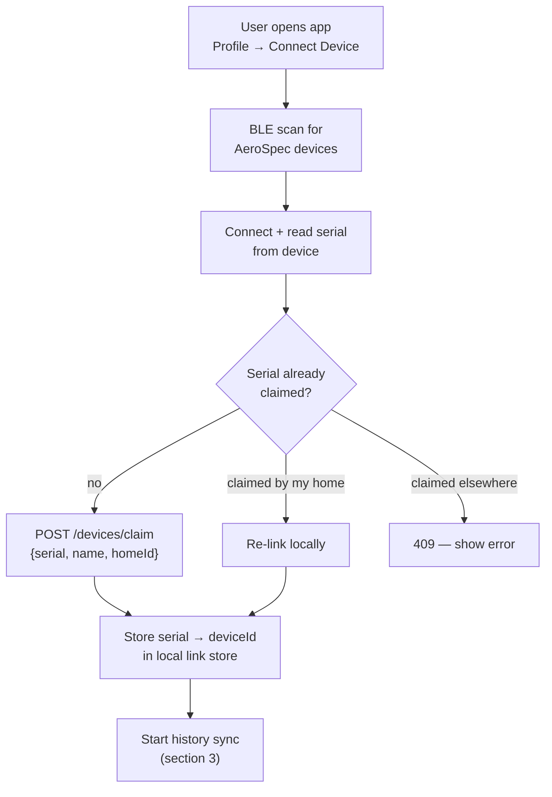
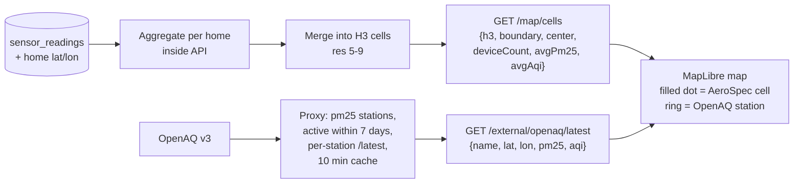
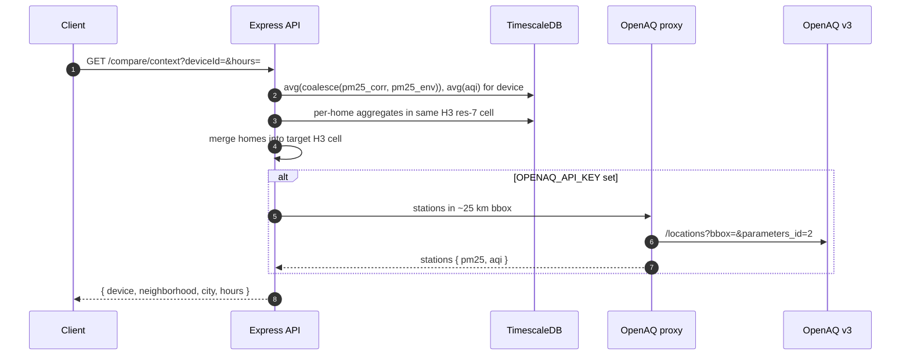
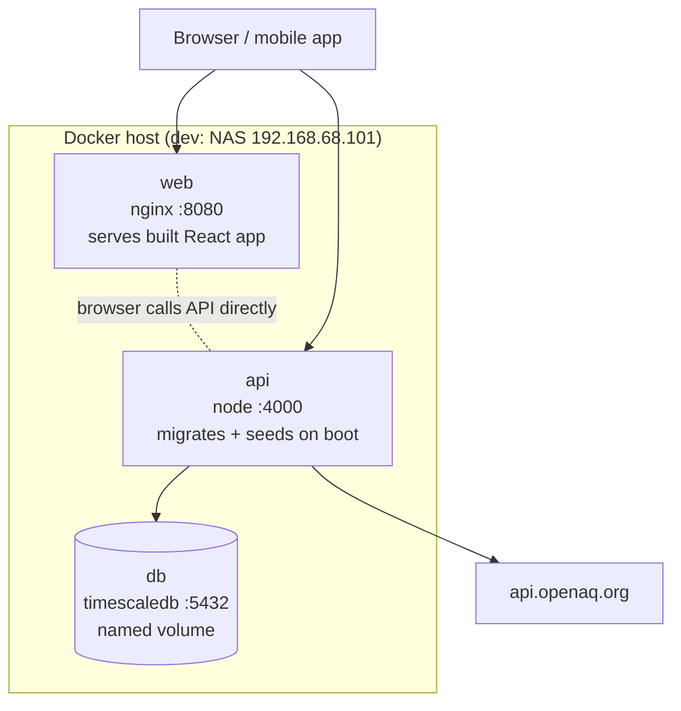

# AeroSpec Architecture

> **Maintenance policy**: this document is the living map of the system.
> Any PR that changes the architecture, API surface, database schema, BLE
> protocol, or deployment topology must update the affected diagram(s) in
> the same PR. Diagrams are [Mermaid](https://mermaid.js.org/) and render
> natively on GitHub.

Companion documents:

- [`README.md`](./README.md) — documentation index (living vs historical)
- [`PIPELINE.md`](./PIPELINE.md) — binding API/data contract between firmware, mobile, API, and web
- [`../AGENTS.md`](../AGENTS.md) — conventions for all agents (Mermaid-first docs)
- Firmware BLE protocol — `AeroSpec-Firmware` repository README

## 1. System overview

Key property: **the sensor never talks to the cloud directly**. It logs to
its SD card and serves data over BLE; the phone is the gateway that uploads
to the API. Cellular on the Boron is used only for clock sync.

## 2. End-to-end data flow

Idempotency: readings are keyed `(device_id, ts)`; re-uploading overlapping
history is safe. The phone keeps a per-device *high-water mark* (newest
uploaded timestamp) so reconnects only transfer the gap.

## 3. Mobile sync state machine

`syncing` = history transfer + batched upload with progress reporting;
`live` = `$D` samples streamed to the UI and uploaded periodically.

## 4. Database schema

`sensor_readings` is a TimescaleDB hypertable when the extension is present
(plain-Postgres fallback works). Range queries downsample server-side: raw
for 24 h, 30-minute buckets for 7 d, 2-hour buckets for 30 d.

`hourly_device_stats` is exposed as a TimescaleDB continuous aggregate when
available, with a plain-Postgres view fallback of the same name and columns.

## 5. Analytics API

The analytics API is home-scoped and authenticated. It reads only
`hourly_device_stats` joined through `devices.home_id`, so it works against
both the TimescaleDB continuous aggregate and the plain Postgres view fallback.
The score library is pure TypeScript and computes metric subscores, missing
metric weight renormalization, and score bands.

## 6. Annotations API

Annotations are timestamped, tagged events scoped to a home (and optionally a
room or device). They support the `FACTOR_TAGS` vocabulary defined in
`packages/types` and are used by `/analytics/factors` to contrast PM2.5 during
tagged windows against a same-hours baseline. Updates and deletes are restricted
to the annotation creator or the home's `owner`.

## 7. Device onboarding workflow

## 8. Map & crowd-sourced data privacy

User-owned home locations are **never exposed individually**: readings are
aggregated by home inside the API, then merged into H3 hex cells before any
map response is returned. Public map detail is clamped to H3 resolutions 5-9;
resolution 8 averages roughly 0.7 km² per hex, and resolution 9 is the
maximum-detail cap. Serials, device coordinates, and exact home coordinates
stay server-side. OpenAQ requires an API key (`OPENAQ_API_KEY` in `.env`).

### Device vs neighborhood vs city comparison

`GET /compare/context` composes three independent sources into a single
three-way comparison:

1. **Device** — average PM2.5/AQI from the device's own readings over the
   requested window.
2. **Neighborhood** — H3 resolution-7 cell that contains the device's home,
   aggregating all AeroSpec devices whose home falls in that cell.
3. **City** — mean of nearby OpenAQ stations within a ~25 km bbox, served by
   the same cached proxy used for the map. This block is best-effort and
   returns `null` when the key is missing, no stations report PM2.5, or the
   upstream call fails.

## 9. Deployment

Single `docker compose up -d --build` brings up all three services; the API
runs migrations and (when `SEED_ON_BOOT=true` and the DB is empty) seeds
demo data on startup. `VITE_API_URL` is baked into the web build — set it to
the externally reachable API URL before building.

## 10. Repository layout

| Path | What lives here |
|---|---|
| `apps/api` | Express + TypeScript API, DB migrations/seed, AQI lib |
| `apps/web` | React + Vite dashboard, MapLibre map |
| `apps/mobile` | Flutter app: BLE stack, sync state machine, dashboards |
| `packages/types` | Shared TypeScript types |
| `packages/data` | Demo data generators |
| `docs/` | This file + `PIPELINE.md` contract |
| `infra/` | Deployment helpers |
