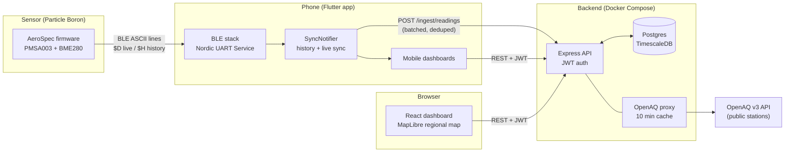
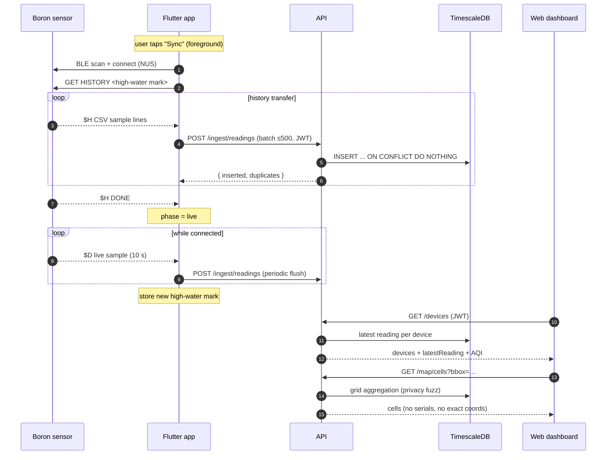
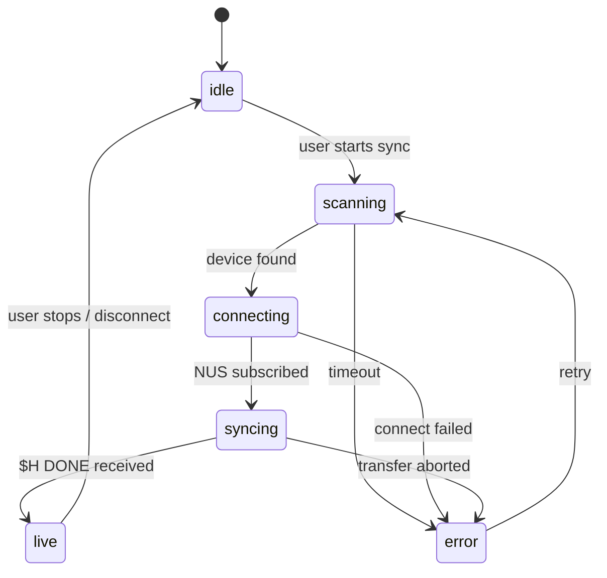
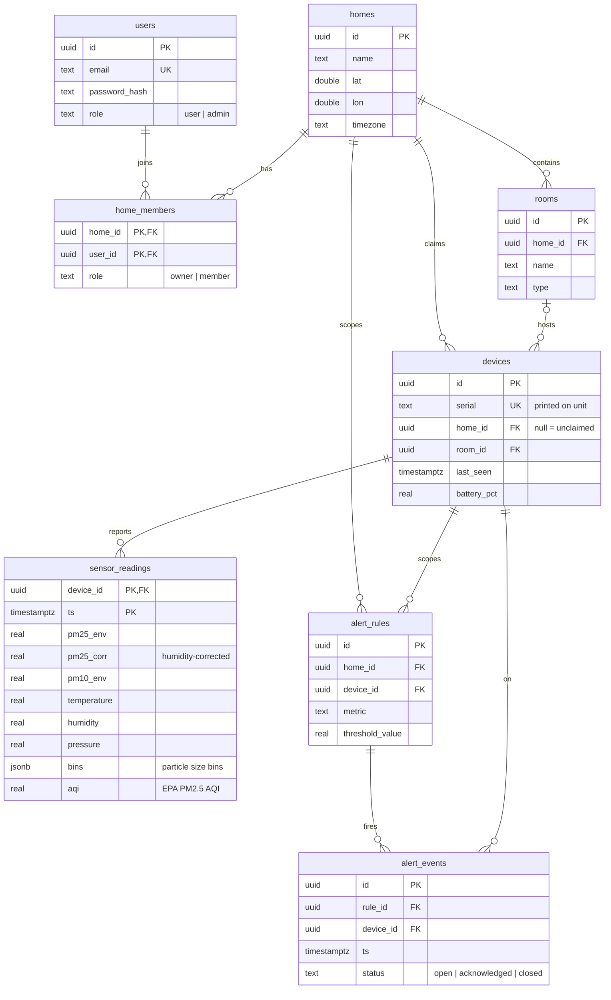
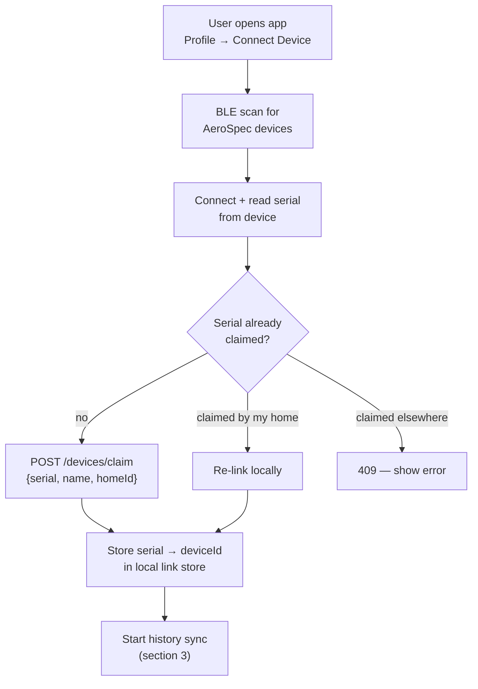
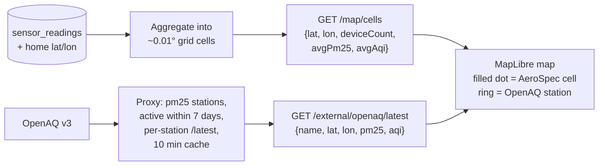
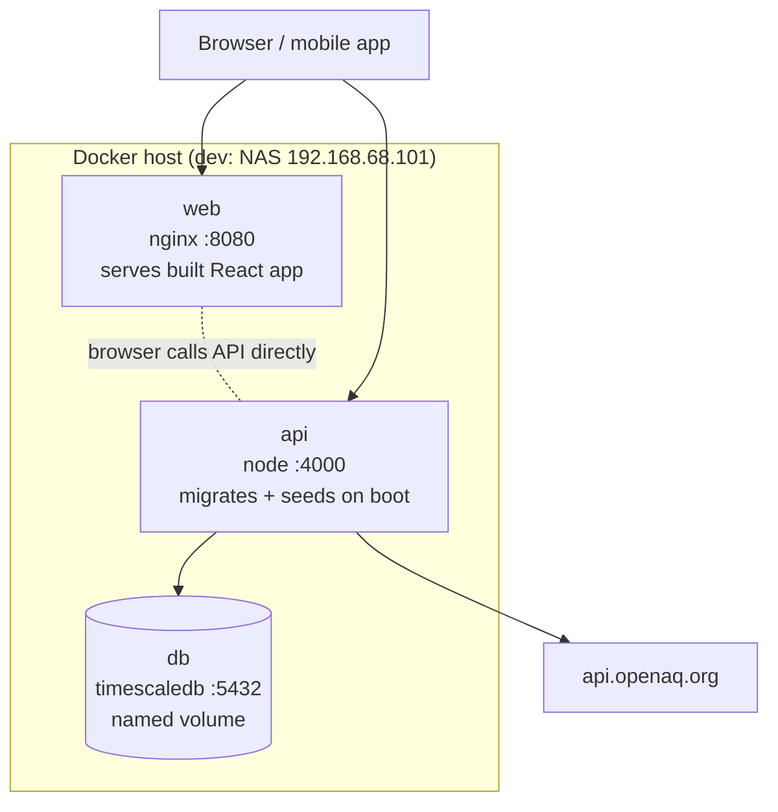

# AeroSpec Architecture

> **Maintenance policy**: this document is the living map of the system.
> Any PR that changes the architecture, API surface, database schema, BLE
> protocol, or deployment topology must update the affected diagram(s) in
> the same PR. Diagrams are [Mermaid](https://mermaid.js.org/) and render
> natively on GitHub.

Companion documents:

- [`PIPELINE.md`](./PIPELINE.md) — binding API/data contract between firmware, mobile, API, and web
- Firmware BLE protocol — `AeroSpec-Firmware` repository README

## 1. System overview

Key property: **the sensor never talks to the cloud directly**. It logs to
its SD card and serves data over BLE; the phone is the gateway that uploads
to the API. Cellular on the Boron is used only for clock sync.

## 2. End-to-end data flow

Idempotency: readings are keyed `(device_id, ts)`; re-uploading overlapping
history is safe. The phone keeps a per-device *high-water mark* (newest
uploaded timestamp) so reconnects only transfer the gap.

## 3. Mobile sync state machine

`syncing` = history transfer + batched upload with progress reporting;
`live` = `$D` samples streamed to the UI and uploaded periodically.

## 4. Database schema

`sensor_readings` is a TimescaleDB hypertable when the extension is present
(plain-Postgres fallback works). Range queries downsample server-side: raw
for 24 h, 30-minute buckets for 7 d, 2-hour buckets for 30 d.

## 5. Device onboarding workflow

## 6. Map & crowd-sourced data privacy

User-owned sensor locations are **never exposed individually**: readings are
averaged into grid cells and serials/exact coordinates stay server-side.
OpenAQ requires an API key (`OPENAQ_API_KEY` in `.env`).

## 7. Deployment

Single `docker compose up -d --build` brings up all three services; the API
runs migrations and (when `SEED_ON_BOOT=true` and the DB is empty) seeds
demo data on startup. `VITE_API_URL` is baked into the web build — set it to
the externally reachable API URL before building.

## 8. Repository layout

| Path | What lives here |
|---|---|
| `apps/api` | Express + TypeScript API, DB migrations/seed, AQI lib |
| `apps/web` | React + Vite dashboard, MapLibre map |
| `apps/mobile` | Flutter app: BLE stack, sync state machine, dashboards |
| `packages/types` | Shared TypeScript types |
| `packages/data` | Demo data generators |
| `docs/` | This file + `PIPELINE.md` contract |
| `infra/` | Deployment helpers |
