# AeroSpec Data Pipeline Contract

This document is the source of truth for how data flows through the system and
what every component must implement. Phase 1 scope: real end-to-end pipeline.

Diagram index: see [`docs/README.md`](./README.md). System map:
[`ARCHITECTURE.md`](./ARCHITECTURE.md).

## Pipeline overview

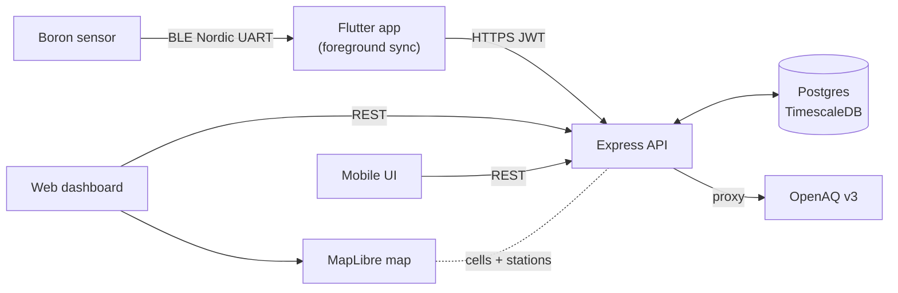

## 1. Device -> Phone (BLE)

Implemented by firmware (see `AeroSpec-Firmware/README.md`). Summary:

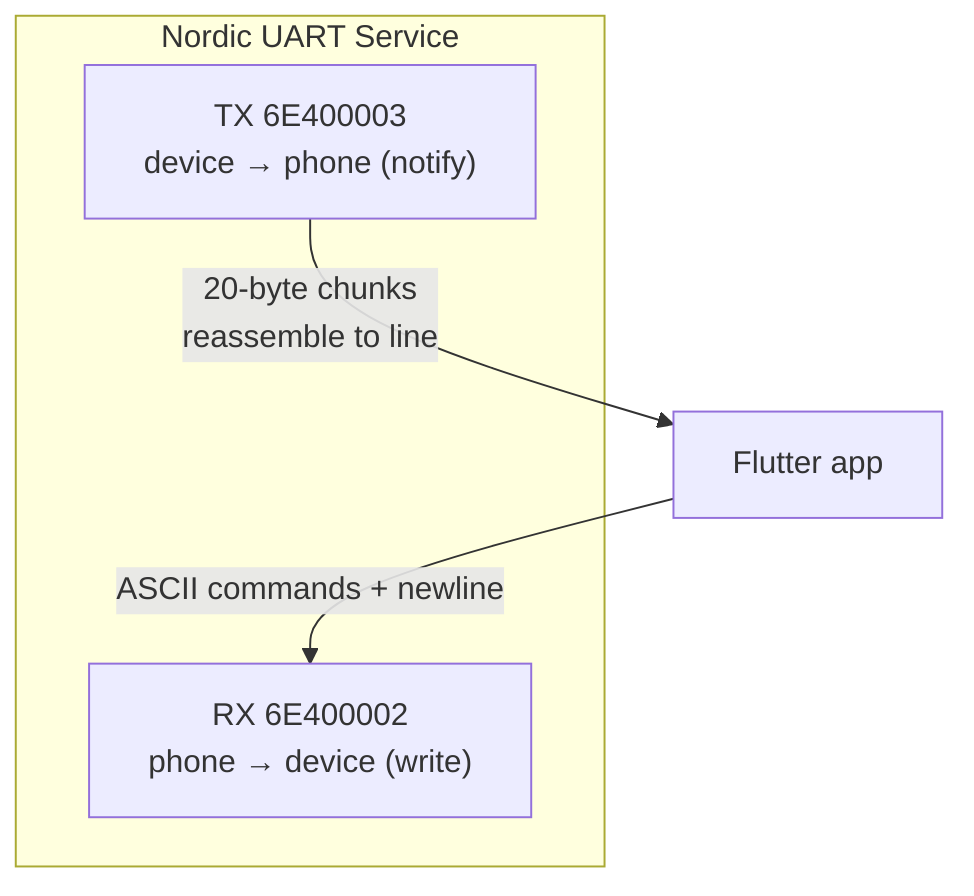

- Advertised name: `AeroSpec`. Nordic UART Service:
  - Service `6E400001-B5A3-F393-E0A9-E50E24DCCA9E`
  - RX (phone->device, write): `6E400002-...`
  - TX (device->phone, notify): `6E400003-...`
- ASCII lines terminated by `\n`, notifications chunked to 20 bytes — the app
  must reassemble until newline.
- Commands the app uses in phase 1: `PING`, `GET INFO`, `GET LIVE`,
  `GET HISTORY`, `SET TIME <unix>`, `SET INTERVAL <s>`, `STOP`.
- Live sample push: `$D,<csv>` every interval while connected.
- History transfer: `GET HISTORY` -> `$H,BEGIN,<bytes>` -> `$H,<csv line>`*
  -> `$H,END,<count>`.

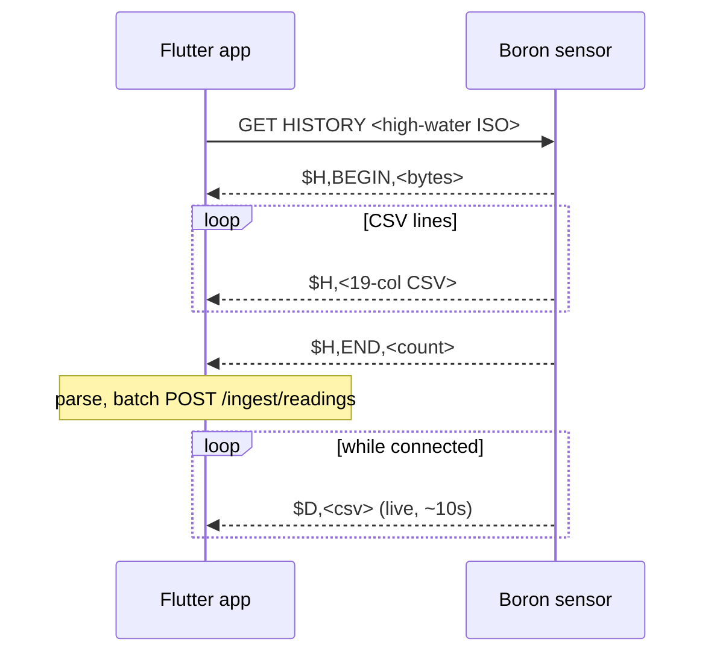

CSV record (19 columns, `NA` = missing, timestamps UTC):

```
Date(YYYY-MM-DD), Time(HH:MM:SS), Battery(V), Temp_C, RH_pct, Press_hPa,
Dp>0.3, Dp>0.5, Dp>1.0, Dp>2.5, Dp>5.0, Dp>10.0,
PM1_Std, PM2.5_Std, PM10_Std, PM1_Env, PM2.5_Env, PM10_Env, PM2.5_Corr
```

`Dp>x` = particle counts per 0.1 L. `PM2.5_Corr` = EPA humidity-corrected
PM2.5 (preferred value for AQI).

## 2. Phone -> Backend (ingestion)

The logged-in app uploads readings on behalf of a claimed device.

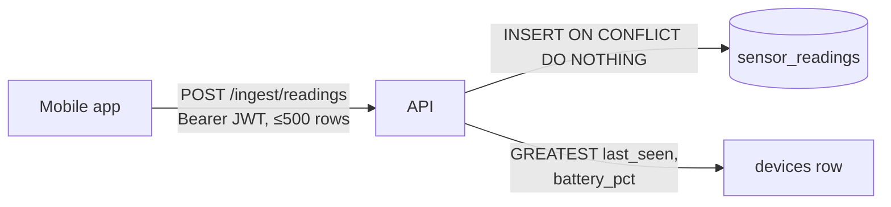

`POST /ingest/readings` (Bearer user JWT)

```json
{
  "deviceId": "uuid-of-claimed-device",
  "source": "ble",
  "readings": [
    {
      "ts": "2026-07-06T21:04:30Z",
      "batteryV": 3.98,
      "temperature": 22.4,
      "humidity": 41.2,
      "pressure": 1012.6,
      "bins": [1234, 400, 80, 12, 3, 1],
      "pm1Std": 4.0, "pm25Std": 6.1, "pm10Std": 7.2,
      "pm1Env": 4.0, "pm25Env": 6.1, "pm10Env": 7.2,
      "pm25Corr": 5.8
    }
  ]
}
```

- Max 500 readings per request; app batches long history transfers.
- Any numeric field may be `null` (firmware `NA`).
- Response: `{ "inserted": n, "duplicates": n }`. Duplicates (same
  `device_id`+`ts`) are silently skipped, so re-uploading overlapping history
  is safe — the app does NOT need exact bookkeeping, but should keep a local
  high-water mark to avoid resending everything.
- Server computes AQI from `pm25Corr` (fallback `pm25Env`) using US EPA
  PM2.5 breakpoints, and updates the device's `last_seen` / battery.

## 3. Backend data model (Postgres + TimescaleDB)

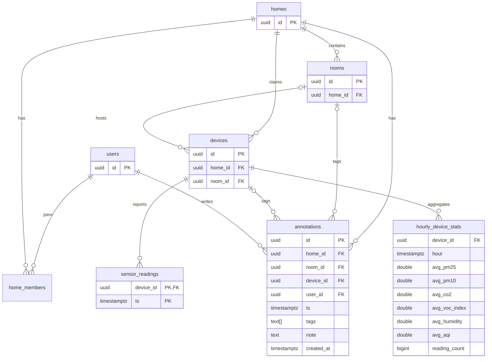

- `users` — id, email (unique), password_hash (bcrypt), name,
  role (`user` | `admin`).
- `homes` — id, name, lat, lon, city, region, timezone.
- `home_members` — home_id, user_id, role (`owner` | `member`).
- `rooms` — id, home_id, name, type, floor.
- `devices` — id, serial (unique, printed on device / user-entered),
  name, home_id, room_id, firmware_version, last_seen, battery_pct.
- `sensor_readings` — TimescaleDB hypertable, PK `(device_id, ts)`. Columns
  mirror the ingest payload plus computed `aqi`. Nullable `co2`, `voc_index`,
  `noise_db` reserved for future hardware.
- `annotations` — user-entered factor notes for a home at timestamp `ts`,
  optionally scoped to a room and/or device. `tags` is a client-owned subset
  of `cooking`, `cleaning`, `windows_open`, `guests`,
  `candles_incense`, `smoking`, `air_purifier_on`, `hvac_on`, `pets`,
  `outdoor_event`, `other`; optional `note` stores free text.
- `hourly_device_stats` — per-device hourly analytics relation with
  `avg_pm25` = `avg(coalesce(pm25_corr, pm25_env))`, plus average PM10, CO2,
  VOC index, humidity, AQI, and `reading_count`. It is a TimescaleDB
  continuous aggregate when TimescaleDB is available, otherwise a plain
  Postgres view with the same name and columns.
- `alert_rules`, `alert_events` — same semantics as the old JSON fixtures.

## 4. Backend HTTP API

All JSON, Bearer JWT except register/login/health. Existing route shapes are
preserved so the web frontend keeps working; new routes marked (new).

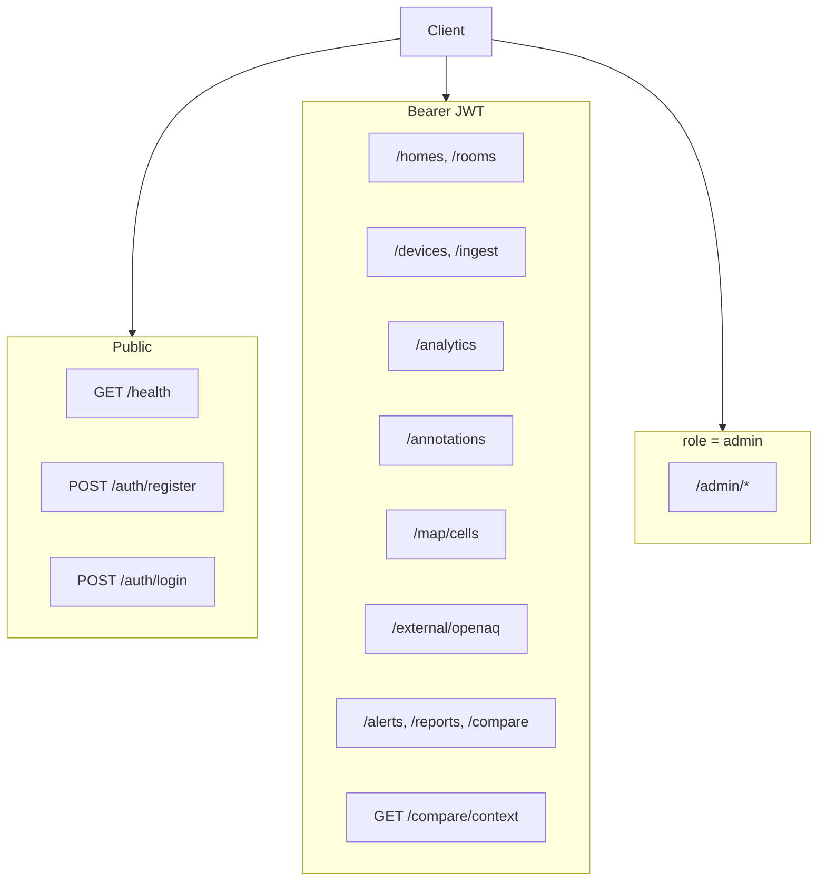

| Route | Notes |
|---|---|
| `POST /auth/register` (new) | name, email, password -> token + user |
| `POST /auth/login` | now verifies bcrypt password |
| `GET /auth/me` | decoded user |
| `GET /homes` / `POST /homes` (new) | homes for user / create home |
| `GET /homes/:id/rooms` / `POST /homes/:id/rooms` (new) | rooms + latest AQI |
| `GET /devices` (new) | user's devices with latest reading |
| `POST /devices/claim` (new) | serial, name, homeId, roomId? -> `{ "device": { "id", ... } }` (the app stores `device.id` per serial and uploads readings under it) |
| `GET /devices/:id/readings?range=24h\|7d\|30d` | time-bucketed (see below) |
| `GET /devices/:id/export`, `GET /homes/:id/export` | CSV/JSON |
| `POST /ingest/readings` (new) | see section 2 |
| `GET /analytics/score?homeId=&date=` (new) | daily 0-100 home air-quality score from hourly stats |
| `GET /analytics/trends?homeId=&range=&metric=` (new) | bucketed score or metric trends |
| `GET /analytics/calendar?homeId=&month=` (new) | day-by-day score calendar for a month |
| `GET /analytics/patterns?homeId=&range=` (new) | hour-of-day and weekday/weekend patterns |
| `GET /analytics/factors?homeId=&range=` (new) | factor contrast vs same-hours baseline |
| `GET /annotations?homeId=&from=&to` (new) | list annotations ordered by `ts` DESC |
| `POST /annotations` (new) | create a factor annotation |
| `PATCH /annotations/:id` (new) | update tags/note/ts; creator or owner |
| `DELETE /annotations/:id` (new) | delete; creator or owner; 204 |
| `GET /map/cells?bbox=&hours=&res=` (new) | privacy-fuzzed H3 aggregation |
| `GET /external/openaq/latest?bbox=` (new) | OpenAQ v3 proxy w/ cache |
| `GET /compare/context?deviceId=&hours=` (new) | device vs neighborhood (H3 res-7) vs city (OpenAQ ~25 km) |
| `/alerts`, `/reports`, `/compare`, `/admin` | same shapes, DB-backed |

### Implementation notes (binding for clients)

- JWT payload is `{ userId, role, email }` with role `user` | `admin`
  (the legacy `owner`/`standard` roles are gone; home-level ownership lives
  in `home_members.role`).
- `GET /devices` returns `{ devices: [...], total }`; each device carries
  `deploymentId` (= serial), `status` (`online` when `last_seen` < 10 min
  ago), `batteryLevel` (percent), `roomName`, `homeName` and `latestReading`
  (camelCase SensorReading with `pm25` = corrected value when available).
- `GET /devices/:id/readings`: `24h` returns raw 10-minute points; `7d`
  averages into 30-minute buckets (~336 points); `30d` into 2-hour buckets
  (~360 points). Uses TimescaleDB `time_bucket` when available, falling back
  to `date_bin` on plain Postgres. Response keeps the
  `{ deviceId, range, readings, pagination }` envelope, readings ascending.
- `GET /map/cells` responds `{ cells: [...], total, hours, resolution }`.
  `bbox=minLon,minLat,maxLon,maxLat` is required; `hours` clamps to 1..720;
  optional `res` clamps to H3 resolutions 5..9. Without `res`, the server
  selects resolution from bbox longitude span: `>2° => 5`, `>0.5° => 6`,
  `>0.15° => 7`, otherwise `8`. Each cell is
  `{ h3, resolution, centerLat, centerLon, lat, lon, boundary, deviceCount,
  avgPm25, avgAqi, lastTs }`. `boundary` is GeoJSON coordinate order
  `[[lon, lat], ...]`. `lat` and `lon` are deprecated aliases for
  `centerLat` and `centerLon` kept for the current web map.
- `GET /external/openaq/latest` responds `{ stations: [...], total, cached }`
  with stations `{ id, name, lat, lon, pm25, aqi, lastUpdated }`.
- Analytics routes require Bearer JWT plus home membership. They query
  `hourly_device_stats` by its public relation name/columns only, joined
  through `devices.home_id`.
  - `GET /analytics/score?homeId&date=YYYY-MM-DD` defaults `date` to today
    UTC and responds `{ homeId, date, score, band, breakdown, hoursWithData }`.
    `score` is `null` when no hourly stats exist. `breakdown` items are
    `{ metric, subscore, weight, avgValue }`.
  - `GET /analytics/trends?homeId&range=day|week|month|year&metric=score|pm25|pm10|co2|vocIndex|humidity|aqi`
    returns `{ homeId, range, metric, points, summary }`. Buckets are hourly,
    6-hour, daily, and weekly respectively; `points[]` is `{ ts, value }`,
    and `summary.delta` is the last non-null bucket minus the first non-null
    bucket.
  - `GET /analytics/calendar?homeId&month=YYYY-MM` returns
    `{ homeId, month, days, bestDay, worstDay }`, where each day is
    `{ date, score, band, worstMetric }`.
  - `GET /analytics/patterns?homeId&range=7d|30d|90d` defaults to `30d` and
    returns `{ homeId, range, hourly, bestHour, worstHour, weekday, weekend }`.
  - `GET /analytics/factors?homeId=&range=7d|30d|90d` defaults to `30d` and
    returns `{ homeId, range, factors }`. Each factor is
    `{ tag, events, avgPm25During, baselinePm25, deltaPct }`; `deltaPct` is
    `(during - baseline) / baseline * 100` rounded to one decimal. This is a
    contrast metric, not proof of causation.
- `/reports/weekly` computes reports on the fly (no stored reports). Report
  ids are `weekly-<homeId>`; `GET /reports/:id` and `/reports/:id/export`
  recompute. Metric stats include `minValue` in addition to
  avg/max/alertCount.
- `POST /homes` accepts `{ name, lat?, lon?, city?, region?, timezone? }`;
  the creator becomes the home's `owner` in `home_members`.
- `POST /homes/:id/rooms` accepts `{ name, type?, floor? }`.
- `POST /devices/claim` `{ serial, name, homeId, roomId? }` creates the
  device row if the serial is unknown, claims it when unclaimed, and returns
  409 if another home already claimed it.

### Annotations (`/annotations`)

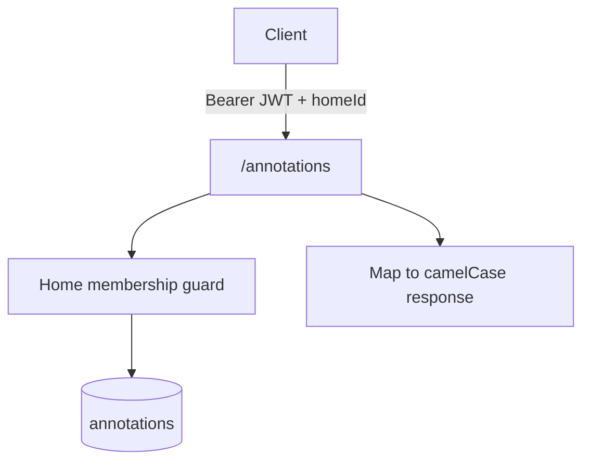

- `POST /annotations` accepts `{ homeId, roomId?, deviceId?, ts, tags[], note? }`.
  `tags` must be non-empty and every tag must be one of `cooking`, `cleaning`,
  `windows_open`, `guests`, `candles_incense`, `smoking`, `air_purifier_on`,
  `hvac_on`, `pets`, `outdoor_event`, `other`. `ts` is a required ISO timestamp.
  The caller must be a member of `homeId`. Response: `201 { annotation }`.
- `GET /annotations?homeId=&from=&to` returns `{ annotations, total }` ordered by
  `ts` DESC. `from` and `to` are optional ISO bounds; membership is enforced.
- `PATCH /annotations/:id` accepts `{ tags?, note?, ts? }`. Only the annotation
  creator or the home's `owner` may update it. Response: `{ annotation }`.
- `DELETE /annotations/:id` is allowed for the creator or the home's `owner`;
  responds `204`.

### Factor contrast (`/analytics/factors`)

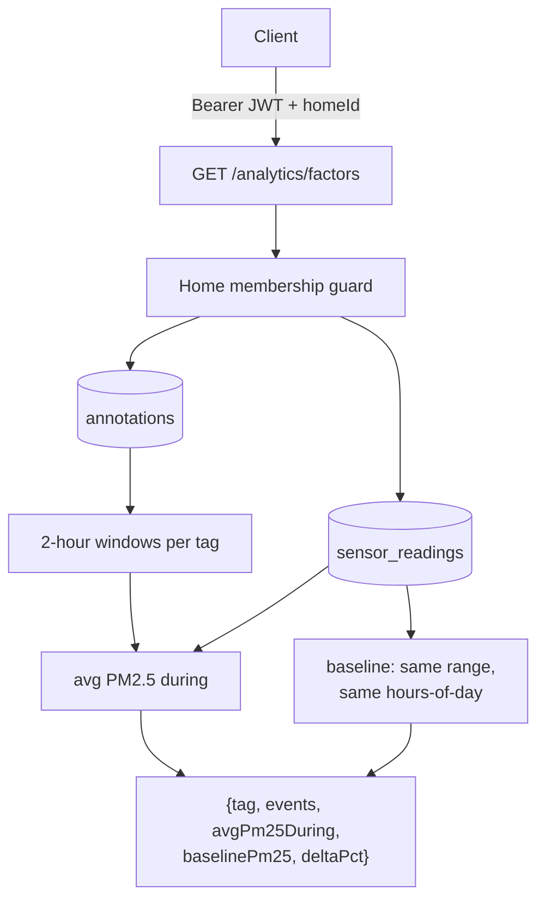

For each annotation tag present in the selected range, `/analytics/factors`
compares the average PM2.5 inside `[annotation.ts, annotation.ts + 2h]` against
a baseline computed from the same date range but restricted to the same
hours-of-day touched by the tagged windows. Tags with no annotations in the
range are omitted.

### H3 privacy aggregation (`/map/cells`)

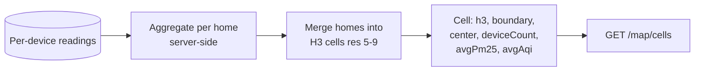

Per-home locations are **never exposed**. The database query aggregates
readings by home only inside the API process, then the response merges those
home aggregates into H3 hex cells. Public detail is capped to resolution 9 and
may be coarser for wide bounding boxes; resolution 8 averages roughly
0.7 km² per hex, while resolution 9 is the maximum-detail cap. Each cell
returns the H3 id, center, boundary, device count, weighted average PM2.5/AQI,
and last timestamp. Serials, device coordinates, and exact home coordinates
stay server-side.

### Analytics (`/analytics`)

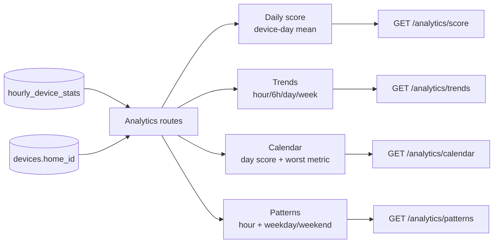

Score is 0-100 where higher is better. Metric subscores are linearly
interpolated between configured breakpoints: PM2.5, PM10, CO2, VOC index, and
humidity. Weights are PM2.5 `.40`, CO2 `.20`, PM10 `.15`, VOC `.15`, and
humidity `.10`, renormalized over metrics present in each hourly row so
current devices with null CO2/VOC still produce a score. Hourly score is the
weighted mean of available subscores; daily device score is the mean of hourly
scores; daily home score is the mean of device daily scores. Bands are
`excellent >=80`, `good >=60`, `fair >=40`, `poor >=20`, otherwise `bad`.

### OpenAQ proxy

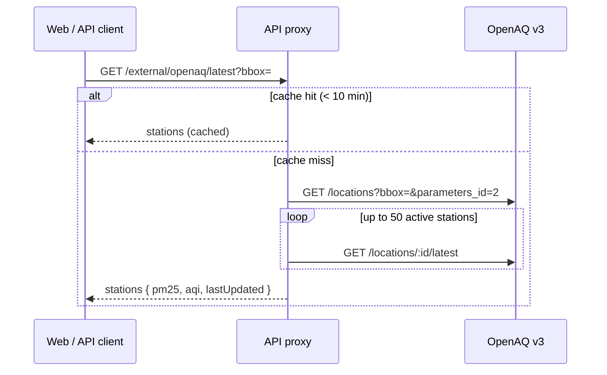

`GET /external/openaq/latest?bbox=minLon,minLat,maxLon,maxLat` proxies OpenAQ
v3. It lists stations via
`https://api.openaq.org/v3/locations?bbox=...&parameters_id=2&limit=100`
(pm25-capable stations only), drops stations whose `datetimeLast` is older
than 7 days, then fetches `/v3/locations/:id/latest` for up to 50 stations in
parallel to obtain current pm25 values (v3 stopped embedding `sensors[].latest`
in the list response). Requires env `OPENAQ_API_KEY` (v3 returns 401 without
a key). Responses are cached in memory for 10 minutes keyed by bbox and
normalized to `[{ id, name, lat, lon, pm25, aqi, lastUpdated }]`. Upstream
failures return `502 { error }`; per-station fetch failures degrade to
`pm25: null` for that station only.

### Compare context (`/compare/context`)

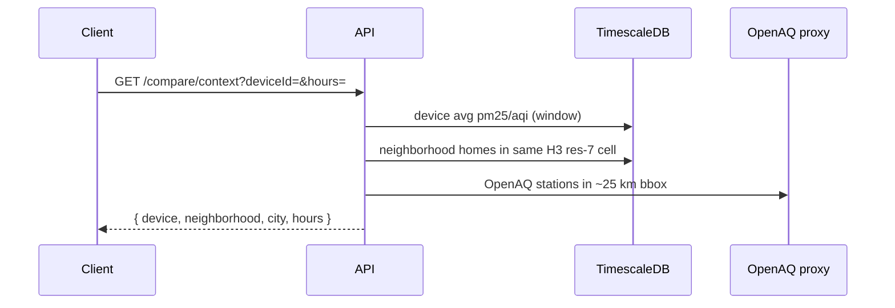

`GET /compare/context?deviceId=<uuid>&hours=24` returns a three-way
comparison for a single device:

- `device` — `{ id, name, avgPm25, avgAqi }` averaged over the requested
  window from `sensor_readings` (`coalesce(pm25_corr, pm25_env)`), null-safe.
- `neighborhood` — `{ h3, resolution: 7, deviceCount, avgPm25, avgAqi }`
  for all devices whose home falls in the same H3 resolution-7 cell as the
  device's home, same window. `null` when the home has no lat/lon.
- `city` — `{ name, stationCount, avgPm25, avgAqi, source: "openaq" }`,
  the mean of OpenAQ stations within a ~25 km bbox around the home, using the
  same cached proxy as `/external/openaq/latest`. `name` prefers the home's
  `city` field, otherwise the nearest station's name. `null` when
  `OPENAQ_API_KEY` is unset, no stations report pm25, or upstream fails.

`hours` clamps to `1..168` (default `24`). Auth requires JWT membership of
 the device's home (`404` unknown device, `403` non-member). `pm25` rounds
 to one decimal; `aqi` is an integer.

## 5. Environment

```
DATABASE_URL=postgres://aerospec:aerospec@db:5432/aerospec
JWT_SECRET=<random>
OPENAQ_API_KEY=<optional>
PORT=4000
FRONTEND_URL=http://localhost:8080
```

`docker compose up` starts db (timescale/timescaledb), api (runs migrations on
boot), web (nginx). `pnpm db:seed` creates the demo admin
(`admin@aerospec.io` / `aerospec-admin`) and a demo home with simulated data.

## 6. Mobile sync flow (foreground)

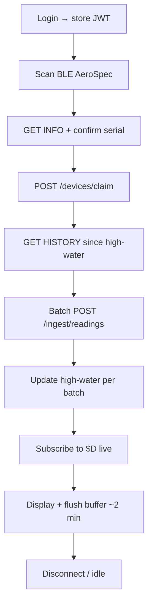

1. User logs in (JWT stored in secure storage).
2. Device claim: scan BLE for `AeroSpec`, connect, `GET INFO` to read firmware
   + status, user enters/confirms serial, `POST /devices/claim`.
3. Every time the app is opened with the device in range:
   `connect -> GET INFO` (if clock unset: `SET TIME <now>`) `-> GET HISTORY`,
   parse lines newer than the local high-water mark, batch-upload via
   `/ingest/readings`, update high-water mark, then stay subscribed to `$D`
   live samples (display + upload periodically).
4. Sync must survive partial failure: server-side dedupe makes retries safe.

Mobile implementation notes (phase 1):

- The high-water mark is advanced per successfully uploaded batch (not per
  transfer), so an interrupted upload only resends the failed batch.
- History records with `NA` date/time (logged before the clock was set) are
  displayed but never uploaded — `ts` is required by the ingest contract.
- Live `$D` samples are buffered locally and flushed every ~2 minutes; a
  failed flush keeps the buffer and retries on the next tick.
- `POST /homes` is called with `{ "name" }` only when the user has no home
  yet ("My Home"); location fields are optional at creation time.
